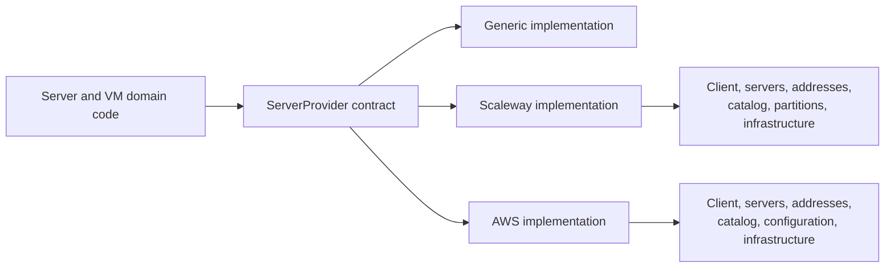

# Atlas settings, providers, and host binaries

[Atlas app specification](../SPEC.md)

For the provider overview, see [docs/providers.md](../docs/providers.md).

## Purpose

Atlas talks to an infrastructure provider only through one interface. Everything provider-specific lives behind it, so adding a provider never reaches into server or virtual machine code.

This module also holds site settings, the regional token key, the wildcard TLS certificate, the private Metal certificate authority, and the host binaries.

The Placement Strategy section selects a registered placement strategy and defaults to `balanced`. Its choices come from the strategy registry, and unknown names are rejected. The section also stores `sleepy_vm_overcommit_factor`, which defaults to `1.0` and must be finite and at least `1.0`. A sleepy VM has `sleep_after_idle_seconds` greater than zero. The factor is available to strategies. `default_metal_machine_size` and `default_metal_machine_image` select the catalog entries used for a new host. See the [VM placement specification](../vm/SPEC.md#placement).

## Types

| Type | Owns |
|---|---|
| `AtlasSettings` (DocType) | Provider selection, credentials, the regional token key, and the published binary links. |
| `AtlasSetup` | Applies deployer settings and completes provider, DNS, catalog, and certificate setup. |
| `ServerProvider` | The contract every server provider implements. |
| `registry` | The map from a stable provider name to its implementation. |
| `DNSProvider`, `Route53Provider` | The DNS contract and its Route 53 implementation. |
| `host_binaries` | Building and publishing `metald` and the Atlas WG Mesh CLI. |
| `artifacts` | Publishing a build output as a public File, and its download URL. |
| `LetsEncrypt` | Wildcard certificate issuance through the dns-01 challenge. |
| `AcmeClient` | The ACME v2 conversation for one account key. |
| `certificate` | Creating and checking certificate authorities, certificates, and private keys. |
| `tls.metal` | Creating the regional Metal authority and each node certificate. |
| `SSHTask` (DocType) | Records one SSH command for a Metal Server or a Virtual Machine. |
| `ssh`, `parsing`, `mesh_address`, `object_storage` | Host access, strict input parsing, mesh addressing, and object storage. |

## Provider boundary

A provider component never saves a Frappe document. It returns typed values, and the caller decides what to record. That keeps provider code testable without a database and keeps persistence in one place.

Metal Server Size stores disk capacity in GiB and price in integer USD cents. The provider fills a missing billing period from the price it does report.

## Wildcard TLS

A wildcard name can only be proved through DNS, so `LetsEncrypt` answers the ACME dns-01 challenge with the configured `DnsProvider` and uses no other challenge type. `AcmeClient` speaks the protocol and touches no file. The account key is the only durable local state.

Atlas Settings owns the certificate chain, the private key, and the expiry. The expiry is read from the certificate on every validate, so the stored values cannot drift apart.

## Metal TLS

Atlas Settings owns one private certificate authority for the region. Atlas creates it after the region name and wildcard domain are available.

Each Metal Server owns one certificate and private key from this authority. The certificate identity is `<server>.<wildcard_domain>`. Its subject alternative names contain the WireGuard, private, and public IP addresses. The certificate permits TLS client and server use.

Atlas Settings also owns one client certificate with the identity `atlas.<wildcard_domain>`. Atlas presents it on every Metal API call, and Metal accepts only that common name. A node certificate is valid for client use on the coordination API, so the common name is what separates Atlas from a node.

Atlas writes the authority certificate and the client pair to private site files for Metal API clients and the console bridge. The authority private key stays in Atlas Settings. Host installation sends the node certificate, node key, and authority certificate through a direct SSH execution that does not create an SSH Task record.

`ensure_server_certificate` issues a new certificate when the stored one is absent, does not match the server identity and addresses, or expires inside the renewal window of 30 days. Metal Server stores the expiry in `metald_tls_expires_on`. A daily job queues a renewal for each ready host inside that window, and reports an error when the authority itself expires inside 180 days. The operator can also start one renewal with the Metal Server action Renew TLS Certificate. See [Metal Server setup](../metal_server/SPEC.md).

## SSH tasks

An `SSH Task` records one shell command or script run for a `Metal Server` or a `Virtual Machine`. Its `target` field is a Dynamic Link. The task reads the target document's `ssh_host` property for the connection address.

An `SSH Task` stores no credentials. It uses the identity of the Atlas host. The caller must make the target reachable.

Do not put a key or password in `script` or `environment`. These fields are stored as plain text. Use `SSHRunner` directly when the command needs secret data. See the [SSH Task guide](doctype/ssh_task/) for the creation methods and task states.

## Host binaries

A build runs only when its source hash changes. Atlas publishes the result as a public File because a host has no Atlas credential.

`artifacts` publishes build output and its download URL. It keeps a replaced File until no Atlas Settings link refers to it. The [Service module](../service/SPEC.md) uses the same helper for its package.

## Automatic setup

The `configure-atlas` site command reads one JSON document from standard input. The `atlas-vm` setup script uses this command and does not put secrets in process arguments. The script also applies the VM placement and Metal auto-spawn settings from `[atlas.vm_scheduling]`.

The command keeps provider resource identifiers after each successful setup phase. A repeated command updates mutable settings and rejects changes to completed provider identities.

Each external setup phase commits its local state. A cloud or certificate operation cannot roll back, so the next run needs this state for reconciliation.

The command uses an existing public Route53 zone. It does not create a hosted zone. It gets both Metal Server catalogs and issues the wildcard certificate before it reports success.

## Related

- [docs/providers.md](../docs/providers.md) describes the provider contract and how to add a provider.
- [docs/wildcard-tls.md](../docs/wildcard-tls.md) describes the certificate lifecycle and renewal.
- [docs/development.md](../docs/development.md) lists the build tools and manual build commands.
- [server SPEC](../metal_server/SPEC.md) describes the provider interface consumer.
