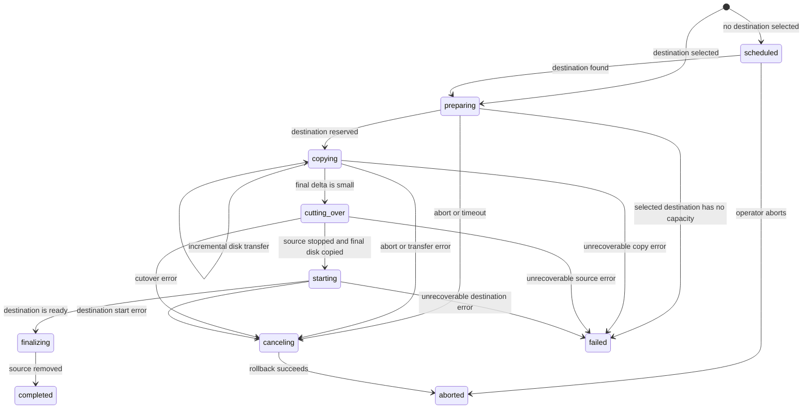
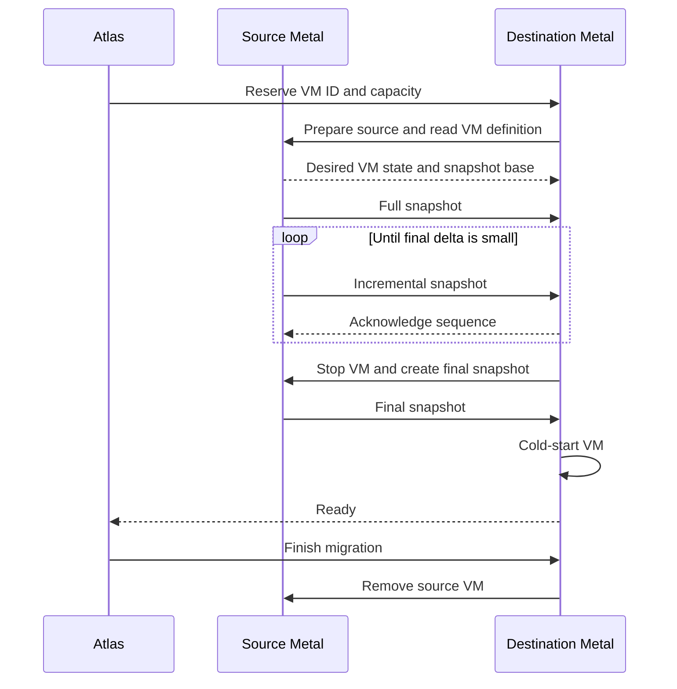
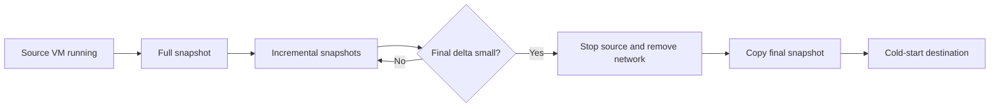
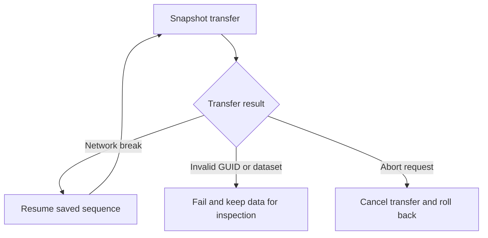

# Virtual machine migration

Migration moves a virtual machine from one Metal host to another. Atlas owns the migration request and destination intent. Metal copies the disk and controls the source and destination runtimes.

## Why migration has checkpoints

A migration crosses two hosts and can stop a running VM. Each external action is recorded before the next action starts. A restart can continue from the last safe checkpoint or roll back without relying on worker memory.

The destination stays hidden from normal VM reads until it is ready. This prevents Atlas from showing two owners for one VM.

## What you need

- A running VM with a compatible image and enough capacity on the destination.
- A Metal connection between the source and destination hosts.
- A destination selected by an operator or enough capacity for Atlas to select one.
- Time for repeated disk transfers when the VM changes its disk during the copy.

## Lifecycle

## Start a migration

Use **Migrate VM** in **Dangerous Actions** on the Virtual Machine form. Select a destination Metal Server, or leave it empty for Atlas to select one.

Desk users cannot create or edit migration records directly. Atlas creates the record and starts the workflow after the request commits.

## Resize a VM that does not fit

A resize of a stopped VM starts a migration when the current host cannot hold the new CPU, memory, or disk size. See [resize](../vm/SPEC.md#resize). The migration stores the target shape in `target_cpu_millicores`, `target_memory_mib`, and `target_disk_mib`. These fields stay `0` on a plain migration.

- Atlas selects a destination that holds the target shape. It excludes the source host.
- Atlas sends the target shape in the Metal create request. The destination checks and reserves that shape, grows the copied disk, and starts nothing because the VM is stopped.
- At `finalizing`, Atlas stores the new server and the target shape in one transaction.
- When the migration fails or aborts, the VM stays on the source with its old shape.

While the migration runs, the tenant API reports the VM state as `migrating`.

## How the copy works

Metal first copies a full snapshot while the VM runs. It then copies incremental snapshots. The source keeps the last acknowledged snapshot as the next incremental base.

The destination does not transfer guest memory or Firecracker warm state. It starts the VM from the copied disk and applies the original desired state.

## Cut over a running VM

Atlas compares each incremental snapshot with `migration.final_delta_mib`. Metal copies another delta while it is larger than that limit. When the delta is small enough, Metal stops the source and takes the final snapshot.

Metal also stops the source after 16 intervals or 30 minutes. This bounds the time before cutover when a VM keeps changing its disk.

The source removes its network before it takes the final snapshot. This prevents both hosts from owning a live VM at the same time.

## Common scenarios

### A running VM reaches the destination

The source stays available during the full and incremental copies. Metal limits the final delta, stops the source, copies the last snapshot, and cold-starts the destination.

### A stopped VM reaches the destination

Metal stops the source before the first transfer. It copies the disk, starts the destination, and does not need a cutover loop.

### A transfer fails

Metal keeps the last completed snapshot sequence and the migration records. A network break can resume the same sequence. A snapshot identity or dataset mismatch fails the migration and keeps data for inspection.

## Read migration state

| Status | Meaning |
|---|---|
| `scheduled` | Atlas waits for an eligible destination. |
| `preparing` | Atlas reserved the destination and Metal prepares the source. |
| `copying` | Metal copies full and incremental disk snapshots. |
| `cutting_over` | Metal stops the source and copies the final snapshot. |
| `starting` | Metal starts the VM on the destination. |
| `finalizing` | Atlas changes the VM server and Metal removes the source. |
| `canceling` | Metal removes destination data and restores the source when needed. |
| `completed` | The destination owns the VM. |
| `failed` | The migration cannot continue automatically. |
| `aborted` | The operator canceled the migration and rollback finished. |

`progress_percent` estimates lifecycle progress. It is not a disk copy percentage because a running VM can create more data during the migration. Use transfer rows and transfer fields for copied MiB values.

## Failure and recovery

An abort before the source stops removes the destination data and unlocks the source. An abort after the source stops restores the source with a cold start before it unlocks the source.

The first finish or abort request wins. A finish is valid only after the destination reports `ready`. A rollback failure keeps both hosts locked and keeps the snapshots for inspection.

Atlas retries from durable migration state. Metal keeps source and destination records until cleanup completes. Do not delete those records by hand while a migration is non-terminal.

## Read the implementation details

- [Metal migration internals](../../metal/internal/vm/migration/SPEC.md) explains locks, snapshot transfer, cutover, transport, and recovery.
- [VM control plane](vm-control-plane.md) explains Atlas intent, placement, and retry boundaries.
- [Metal operations](../../metal/docs/operations.md) explains host-side recovery checks.
