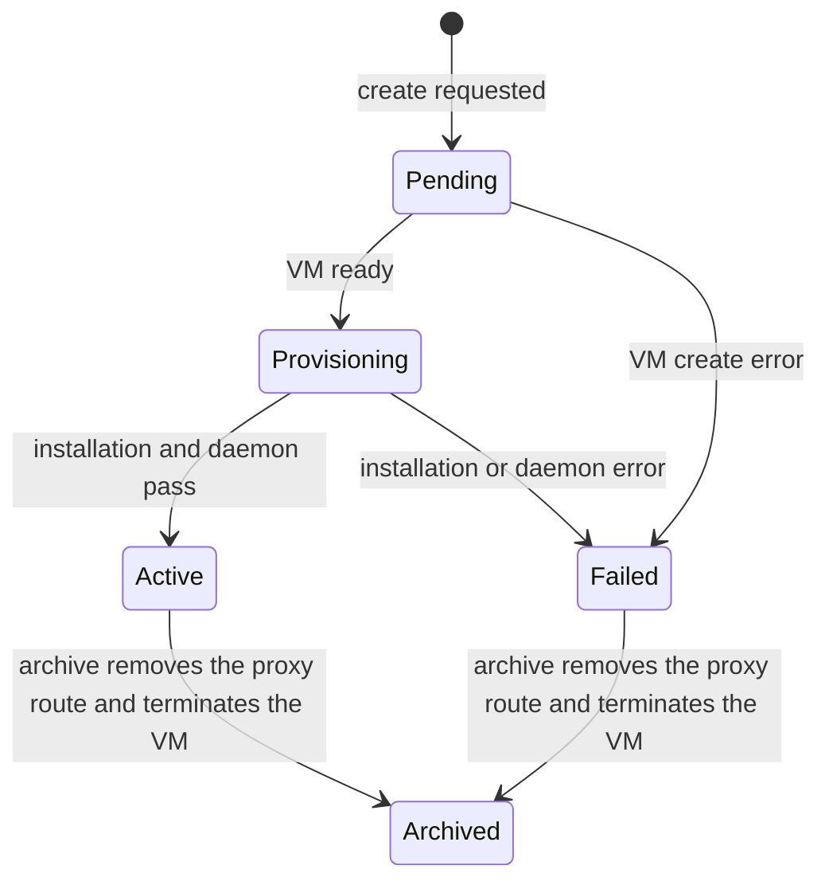

# WireGuard Gateway Server specification

[Service module specification](../../SPEC.md)

## Purpose

Each WireGuard Gateway Server owns one [WireGuard gateway](../../../../services/wg-gateway/README.md)
and its virtual machine. Customers reach their own tenant's private `fdaa`
VMs through the gateway over WireGuard. Access is tenant-wide.

Atlas names each record `wg-gateway-NNN`. The record owns the virtual machine
and the daemon credential; the daemon inside the VM owns the peer list.

## Lifecycle

Create the gateway from the WireGuard Gateway Server list.

Creation needs an enabled Available System image, a reserved tenant-0 IPv4
allocation, a listen port, and an Active Proxy Server. The gateway endpoint is
that IPv4 address and port. Atlas creates the VM for tenant `0` with
privileged mesh access, the default `0.0.0.0/0` route via `host`, the record
name as its hostname, and the Atlas public Secure Shell key. Privilege permits
cross-tenant mesh delivery; the gateway role is not needed, because the
gateway SNATs every forwarded packet to its own mesh address.

Creation returns the daemon bundle for Central: the daemon URL, the audience
its tokens must carry, the public IPv4 address, the listen port, and the
region ID. No secret is stored or returned.

The port is set once. A draft VM keeps the gateway Pending.

Atlas retries Pending and interrupted Provisioning records every minute.

Provisioning waits until Metal has attached the public IPv4 allocation.

## Installation

| Phase | Action |
| --- | --- |
| `secure-shell` | Wait for root Secure Shell access on the public IPv4 address. |
| `installation` | Install WireGuard, nftables, and the gateway daemon with `GATEWAY_MESH`, `LISTEN_PORT`, `REGION_ID`, `JWKS_URL`, `GWGATEWAY_AUDIENCE`, and `JWKS_ISSUERS`. |
| `gateway-api` | Register the `<gateway>.<wildcard-domain>` proxy route, wait for the daemon through the proxy, and read its public key. |

The installer generates the gateway keypair on the VM and keeps it on
reinstalls. A failure sets the status to Failed and stores the phase and
message.

## Daemon API

Central calls the daemon directly through the HTTP proxy at
`https://<gateway>.<wildcard-domain>/`. Callers present an Ed25519 JWT for
the `atlas-wg-gateway:<region>` audience, verified against the Atlas JWKS the
same way the proxy control daemon verifies tokens. The issuer is `central` or
`atlas:<region>`, a `tenant` claim is refused, and the scopes are `*`,
`peers:*`, `peers:read`, `peers:update`, and `gateway:read`.

| Call | Scope | Meaning |
| --- | --- | --- |
| `GET /healthz` | public | The daemon answers. |
| `GET /config` | `gateway:read` | The gateway public key, listen port, region ID, and mesh address. |
| | `GET /peers` | `peers:read` | The peer list with `fdac` addresses. |
| `PUT /peers` | `peers:update` | Replace the complete peer list; returns the list with added, removed, and updated counts. |
| `PUT /peers/{tenant_id}/{client_id}` | `peers:update` | Add one client; returns its record with the `fdac` address. |
| `DELETE /peers/{tenant_id}/{client_id}` | `peers:update` | Delete one client; missing peers are gone. |

`add` takes the Central-provided `public_key`, `tenant_id`, and `client_id`
and returns the assigned `fdac` address. Tenant and client IDs are integers
from 1 to 2^32-1; the client ID is the low 32 bits of the `fdac` address.
Every change rewrites `peers.conf` and `gateway.nft` on the gateway and
applies them with `wg setconf` and `nft -f`.

A reboot reapplies both files from disk through
`atlas-wg-gateway.service`.

The VM firewall stays disabled on the gateway, so handshake and tunnel
packets pass. Tenant isolation is the nftables tenant-wide rule; VM-level
firewalling stays with each VM.

## Archive

Archive removes the proxy route and terminates the gateway VM. The record
stays with status Archived, and the peer list dies with the VM.

## Access

Only System Managers with System User accounts can create or archive a
gateway. Central calls the daemon with its own signed token.
