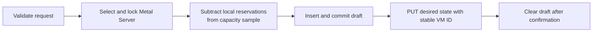

# Virtual machine module specification

[Atlas app specification](../SPEC.md)

For the control-plane overview, see [docs/vm-control-plane.md](../docs/vm-control-plane.md).

## Purpose

Atlas stores what was requested. Metal stores what is running. This module keeps that line: a Virtual Machine record holds the reservation and the request, and every runtime value is read through to Metal instead of copied into a field.

The record name is the Metal VM ID. Atlas assigns each name from the `vm-.#######` series. Deleting a record does not release its number. The stable name makes create idempotent, because a retry addresses the same resource.

## Types

| Type | Owns |
|---|---|
| `VirtualMachine` (DocType) | The reservation, permissions, and the whitelisted API. Runtime values read through. |
| `VirtualMachineImage` (DocType) | The durable boot artifact and its immutable reference. |
| `Virtual Machine State` (DocType) | The last status a host reported for one VM. The name is the VM name. It also answers whether a live VM still needs an image. |
| `Atlas Tag` (DocType) | One key and value label on a Virtual Machine, a Virtual Machine Image, or a Metal Server IP Address. |
| `VirtualMachineService` | Every operation that spans an Atlas record and a Metal host. |
| `PlacementStrategy` | Selects and reserves Metal Servers for one set of placement requirements. |
| `MetalClient` | `/v1` mutual-TLS transport, regional CA verification, and error classification. |
| `metal_models` | Typed read views of Metal responses. |
| `VirtualMachineCreateRequest` | Validated create input. |
| `vm_image_transfer`, `multipart_upload`, `image_builder` | Machine image movement and System image creation. |
| `vm_image_storage_migration` | Moving a bootstrap System image from site files into object storage. |
| `reconciliation` | Settling records whose Metal outcome was never confirmed. |
| `vm_state` | The only writer of Virtual Machine State. The host sync job calls it. |
| `state_webhook` | The Webhook records that deliver each stored state report to a Central. |
| `Virtual Machine Migration` | The scheduled migration request, its lifecycle, and its typed transfer history. See [migration operation](../docs/virtual-machine-migrations.md). |

## Create



The commit before the Metal call is deliberate. The draft must exist on disk before Atlas asks Metal for anything, so a lost response leaves a record to reconcile rather than an orphaned VM.

An uncertain response keeps the draft. Only a Metal `404` deletes it.

Atlas calls the Metal API through HTTPS on the server public IPv4 address. Atlas presents its client certificate and Metal presents its node certificate. Both come from the regional Metal certificate authority.

## Placement

`PlacementStrategy.find_server(requirements)` returns the name of a ready host for VM creation, migration, or resize. It does not return a document. A resize also passes `current_placement`, a `CurrentPlacement` with the current host and the memory and disk that the VM already holds there. The current host then needs room only for the increase, and every other host needs room for the full shape.

`PlacementRequirements` contains the resource, architecture, tenant, and host pool constraints. A strategy owns its snapshot and lock. An explicit migration destination uses `PlacementStrategy.reserve_server`.

`balanced` is the default strategy. It uses separate regular and sleepy host pools. It first keeps a start or resize on the current host when that host matches the VM pool and fits the request. Otherwise, it filters ready hosts by pool, architecture, memory, and storage, then tries them in this order:

1. Fewer VMs from the same tenant.
2. A lower five-minute placement rate.
3. Less CPU shortfall, measured as requested millicores above reported free millicores.
4. Lower maximum projected utilization across memory and storage, then host name.

For a sleepy VM, `balanced` discounts sleepy memory by `sleepy_vm_overcommit_factor` when ranking hosts. The factor does not change hard capacity checks. CPU shortfall is a preference, not a capacity limit.

`spread-3` uses only regular hosts for regular VMs and only sleepy hosts for sleepy VMs. It spreads regular VMs toward the least provisioned eligible host and packs sleepy VMs.

`best-fit` uses the same pools. It packs regular VMs by provisioning and sleepy VMs by memory subscription. Provisioning is the larger memory or storage fraction.

Add a `PlacementStrategy` subclass in `core/placement/strategies/`. Register it with `@register(name)`. Its `select_host` method takes no arguments. It reads the placement data through the properties on `self`. It selects a checked host with `self.try_select(host_name)`.

`self.placement_rate(host_name=None)` returns placements per minute from the five-minute snapshot, including drafts.

```python
@register("example")
class ExampleStrategy(PlacementStrategy):
    def select_host(self) -> None:
        for host in self.host_pool():
            if self.try_select(host.name):
                return
```

`self.usage` is an immutable view of ready hosts with capacity samples no more than two minutes old. It contains resources, tenant counts, sleepy memory, placement counts, and fleet totals.

Placement subtracts recent VMs, drafts, and migration reservations from Metal Server Usage samples. `self.try_select(host_name)` takes a MariaDB named lock and checks current state, memory, and storage. CPU is oversubscribed.

Atlas holds the lock until it commits the draft or migration. The lock name includes the site database and host name.

### Concurrent placement

Placement uses READ COMMITTED so a request sees committed reservations. VM creation and migration enable it at the entry point. A selected host stays locked until Atlas commits.

One placement has a 0.4 second deadline. This includes retries, backoff, and lock waits. A lock wait lasts at most 150 ms.

A strategy probes at most 16 hosts. A busy result randomizes the remaining hosts. If all probes are busy, placement waits on one candidate.

Concurrent requests can share a one-second snapshot. The cache key contains the architecture, host pool, and tenant. Locked reads always check current capacity.

Placement retries up to three times. A capacity rejection caches the shape for 500 ms. Lock contention does not cache a capacity failure.

The snapshot query limits aggregates to the selected host pool. Placement does not load a Metal Server document while it holds the lock.

A placement that selects no host answers `503` and creates no VM draft. Two causes share that status and `error.code` separates them.

| Code | Cause | What the caller does |
|---|---|---|
| `out_of_capacity` | No ready host can hold the request | Retry later, or add capacity |
| `placement_busy` | Every candidate host was held by another placement for the whole deadline | Retry at once, guided by `Retry-After` |

Only `out_of_capacity` expands the fleet. Contention is not a capacity limit, so treating it as one would provision a host the fleet has no use for. When Metal auto-spawn is enabled, Atlas queues a separate capacity expansion job for the required architecture and sleepy-host pool. The job uses Default Metal Machine Size and Default Metal Machine Image. It reuses a matching Pending or Installing host and otherwise provisions one host. The client retries later after a host is Running and has a fresh capacity sample.

A site-scoped database lock serializes the Pending host check and insert for each architecture and host pool. The job refreshes its transaction after it acquires the lock and commits the new host before it releases the lock.

### Simulate strategies

Run registered strategies against the seeded workload from the repository root:

```sh
python -m atlas.simulator.vm_placement --days 30 --seed 1
```

Use `--strategy balanced` to select one strategy, repeat it to compare strategies, and use `--json` for all metrics. See the [example scenario](../simulator/vm_placement/scenario.json).

### Run a live trial

Run `python -m atlas.simulator.vm_placement.live run --help` to see live trial options. The trial places VMs on ready hosts, can create trial hosts, and reports trial resources separately. A failed trial keeps its resources for inspection.

## Reading state

A Virtual Machine property calls Metal once per request and caches the result. A draft reads as `pending`, and a VM that Metal reports as absent reads as `unknown`. Any other Metal failure is raised, so a read fault is never shown as a state.

The list route does not call Metal. It returns `last_known_state` from Virtual Machine State, which holds the last status each host reported. `POST /v1/sync` carries that status for every VM on the host, so one exchange per host refreshes every record. The status is as fresh as the last host reconcile pass, and `state_synced_at` records when Atlas last stored it.

## State delivery

`PUT /api/atlas/webhooks` points the event deliveries of one Central at its receiver. It takes the URL, a shared secret, `central_id` (default 1), and `enabled`. Only a Central token, which carries tenant `*`, can use it. Atlas creates one state Webhook for `on_update` and one for `on_trash`. Their names use `Virtual Machine State - <Event> - Central - <central_id>`. The `on_update` Webhook sends only on insert or on a status change. A repeated call refreshes the Webhooks. `central_id` must be `1` unless developer mode is active or site configuration sets `allow_multiple_central_webhooks` to `1`.

Each delivery is a signed JSON POST with `Content-Type` and `X-FC-Source` (`atlas`). It also includes `X-FC-Region` when a region is set:

```json
{
  "event": "vm.state",
  "virtual_machine": "vm-0000001",
  "status": "running",
  "observed_at": "2026-09-17 08:25:52"
}
```

A removal sends the same fields with the event `vm.state.deleted`.

## Reconciliation

Termination detaches the public IPv4 address and keeps its tenant reservation. The record stays until Metal confirms the VM is absent.

Two scheduled jobs settle records that a lost response left uncertain: stale drafts and terminating VMs. Both ask Metal the same question and share one settle path. Metal is the authority: a confirmed absence deletes the record, and any other failure is logged and left alone, because an unreachable host says nothing about whether the VM exists.

## Images

Virtual Machine Image is the durable boot artifact. `image_type` is `System` or `Machine`. Each image carries a tenant ID, and a Machine image inherits the tenant of its source virtual machine. System images are shared with every tenant. Machine images are visible only to their owning tenant. Each image has its own rootfs and kernel location, exact byte size, and SHA-256 value. The immutable reference uses the architecture and both artifact hashes.

An image also carries `architecture` and a `tags` table. Use a tag for any other selection value. `build-ubuntu-base-image` writes `purpose` as `base`, and the operating system name and version as `os` and `os_version`.

`purpose` says what an image is for, and `image_type` says who can boot it. A base image and a Pilot image are both `system` images, so only the tag separates them.

A virtual machine reads its image once, at creation. It copies the architecture into its own `architecture` field and stores the image name as plain text. There is no link from a virtual machine to an image, so an image can be deleted while its virtual machines run. Placement and migration use the stored architecture and never read the image again.

`artifact_storage` is the single owner of the artifact location. `Object Storage` uses the object keys and signs a URL for 24 hours. `Site File` uses two public site Files and their permanent URLs, which lets Atlas boot a VM before object storage exists. Only a System image can use `Site File`, and the tenant download route refuses one. `vm_image_storage_migration.py` moves an image to object storage after the credentials exist. Atlas Settings queues the migration when the object storage fields change, and a job every 15 minutes queues what is left. See [docs/images.md](../docs/images.md).

Only enabled, Available images can create VMs. Atlas sends enabled, Available images with `cache_image` to each host through `POST /v1/sync`. Signed URLs are valid for 24 hours.

The policy is:

| Cache Image | Memory Snapshot | Host behavior |
|---|---|---|
| No | No | Download on demand. |
| Yes | No | Retain the rootfs and kernel. |
| No | Yes | Use a normal cold boot. |
| Yes | Yes | Retain the artifacts and build a local warm snapshot. |

Atlas never uploads memory or Firecracker state to object storage. A memory snapshot needs an explicit CPU, memory, and disk configuration. Metal boots a local template for about 5 minutes. It keeps the disk, state, and memory on that host. Only an exact VM shape can use these artifacts.

## Machine image transfer

The Create Machine Image action calls `POST /v1/vms/{id}/snapshots`. Metal returns a UUIDv7 for local staging. Atlas uses it as the Virtual Machine Image name. A background job then:

1. Creates separate multipart uploads for `images/{image-id}/rootfs.img` and `images/{image-id}/kernel`.
2. Signs 2 GiB upload parts for 24 hours.
3. Calls `POST /v1/snapshots/{snapshot_id}/upload`.
4. Verifies the sizes, SHA-256 values, part numbers, ETags, and final stored object sizes.
5. Completes both uploads and deletes the local staging data.

The image record keeps the source server, upload IDs, status, and errors. Atlas saves the upload IDs before it asks Metal to start. A start or finalization error marks the image as Failed and keeps the retry values. Retry Transfer uses these values. `source_virtual_machine` is audit text only. Metal deletes staging after 48 hours without activity.

## Machine image deletion

`vm_image_deletion.py` owns Machine image removal. The request marks the image `Deleting`, disables it, and queues a repeatable cleanup job.

`is_termination_protected` refuses the request and the document delete. A System image is protected when it is created, because the Atlas services boot from one. A snapshot request can protect a Machine image, and the termination protection action changes it later.

A live virtual machine holds its image. A virtual machine is live when it is a draft, because Metal can still pull the artifacts, or when its host reports `running`, `stopped`, or `paused`. A terminating virtual machine, and one with no reported state, does not hold the image. While an image is held, the request archives the image instead of deleting it. A job every 30 seconds reclaims an archived image after its last live virtual machine is gone.

The job aborts every incomplete multipart upload, deletes both stored objects, removes the remaining Metal staging data, and then deletes the record. If a Metal or object storage cleanup operation fails, Atlas keeps the image in `Deleting`, records the error, and queues it again every 30 seconds.

## System image publisher

Build and publish a pinned Ubuntu image:

```sh
bench --site <site> atlas build-ubuntu-base-image --version 24.04 --architecture amd64
```

Add `--storage site-file` to publish the artifacts as public site Files during bootstrap, when object storage does not exist yet.

`image_builder.py` owns the build and publication behavior. The CLI command only validates its options and connects to each selected site. The publisher creates an Available System image and stores exact artifact sizes.

## SSH keys

Atlas can replace the complete VM SSH key list without storing it in the Virtual Machine DocType. Metal saves the list and updates MMDS for an active VM. The base image `AuthorizedKeysCommand` reads the current MMDS keys during each login.

## Privileged VMs

Atlas WG Mesh reserves tenant 0 for the privileged tenant. A privileged VM crosses tenants, so `before_insert` refuses a privileged VM on another tenant.

The whitelist is host state that every host shares. `atlas.server.usage` sends the complete set of live privileged VM addresses to each host with `POST /v1/sync`.

Use `Grant Privilege` and `Revoke Privilege` under `Dangerous Actions` to change the flag. Each host applies the change on its next sync, so it takes up to 30 seconds.

## Per-VM metadata

The image is shared, so nothing per VM can be baked into it. `atlas-metadata.service` reads MMDS and applies the hostname and the mesh address. It writes a systemd-networkd drop-in with the address and the `fdaa::/16` route, then reloads networkd. Each step does nothing when the value already matches.

`atlas-metadata.service` reads MMDS every 250 ms. This lets a warm VM receive its own hostname and address after resume. cloud-init uses `preserve_hostname`, so the service owns the hostname.

When the service writes a new mesh drop-in, it also resets the server features of systemd-resolved, flushes the resolver cache, and queues a restart of systemd-timesyncd. A warm snapshot is captured without egress, so the resolver and time sync resume in a backed-off state. Without this reset, DNS and time sync stay stalled for about 40 seconds after resume.

## Custom metadata

Atlas stores custom VM metadata as key-value rows and sends it to Metal. Guests read each value from `latest/meta-data/attributes/<key>`.

The Ubuntu image builder installs the Atlas cloud-init datasource. See [`build_ubuntu_server_image.sh`](scripts/build_ubuntu_server_image.sh).

## Mesh address

Atlas derives the Atlas WG Mesh address for a VM from the region ID, the tenant ID, and the VM number, and sends it as `network.wireguard_mesh_ipv6`. Metal registers the address on the host and publishes it at `latest/meta-data/mesh-ipv6`.

`atlas-metadata.service` in the guest applies it. See [Per-VM metadata](#per-vm-metadata).

## Network changes

Metal owns the VM network state. Atlas reads the typed desired state and changes one value. Atlas then sends the complete network object.

| Action | Behavior |
|---|---|
| Attach IP Address | Sets an attach intent and sends the address with `uplink` egress. |
| Detach IP Address | Sends an empty address and sets a detach intent. |
| Edit Network Throughput | Sends private and public limits in MiB/s. `0` removes a limit. |
| Edit Firewall | Sends the enabled state and the inbound and outbound allow rules. |
| Change Egress Mode | Sends `uplink`, `mesh`, or `none`. |

Atlas applies the Metal change before it releases an address. A VM can hold one public IPv4 address. Public IPv4, egress, throughput limits, and firewall rules can also be set during creation.

An attach first records the provider intent. The provider reconcile job gets the host address and then sends that address to Metal. VM creation leaves the Metal address empty until this reconcile job succeeds.

The tenant API uses `PATCH /api/atlas/virtual-machines/{id}/network`. A request can change one firewall field. Atlas merges it with the current desired firewall and sends the complete network to Metal.

Firewall rules are allow rules for public and mesh traffic. They support `any`, `tcp`, `udp`, and `icmp`. TCP and UDP rules can select one destination port or one inclusive range. Each rule needs one or more canonical IPv4 or IPv6 prefixes. One firewall can have at most 50 prefix entries.

A disabled firewall permits all traffic and keeps its rules. An enabled firewall blocks unmatched new traffic. An empty direction blocks new traffic in that direction. Established and related connections continue.

Egress controls internet reachability. It does not control mesh reachability.

| Mode | VM can reach | Public IPv4 | Throughput limits |
|---|---|---|---|
| `uplink` | mesh peers and the internet | allowed | private and public |
| `mesh` | mesh peers only | rejected | private applied, public stored |
| `none` | nothing | rejected | none |

A public IPv4 address needs `uplink`. Atlas refuses `mesh` and `none` while an address is attached.

Active connections can stop when the public IPv4 address or the egress mode changes.

## Resize

`VirtualMachine.resize` changes `cpu_millicores`, `memory_mib`, `disk_mib`, and `sleep_after_idle_seconds`. The Resize VM action and `POST /api/atlas/virtual-machines/{id}/actions/resize` call it. An absent value keeps the value that Metal stores. `VirtualMachineResize` in `vm/core/vm_resize.py` owns the flow.

```text
resize request
   │  CPU, memory, or disk change needs a stopped VM; the disk only grows
   ▼
find_server(target shape, current_placement)
	├── current host ──► PUT resize ──► store the shape
	│                      └── 409 insufficient_capacity ──┐
   └── other host ────────────────────────────────────────┴──► resize migration
```

- An idle shutdown change alone needs no capacity. It changes in place on a VM in any state.
- A resize migration stores `target_cpu_millicores`, `target_memory_mib`, and `target_disk_mib`. Placement reserves that target shape on the destination. Metal gives the VM the target shape on the destination, and Atlas stores it with the new server in one transaction. See [virtual machine migration](../docs/virtual-machine-migrations.md#resize-a-vm-that-does-not-fit).
- An idle shutdown change that goes with a move changes on the source first, so the migration copies it.
- `sleep_after_idle_seconds > 0` selects the sleepy host pool. A resize places the VM in the pool of its new value. An idle shutdown change alone does not move the VM.
- A capacity sample can be older than the host. When Metal refuses the current host with `409 insufficient_capacity`, Atlas starts a resize migration.

## Automatic idle shutdown

`sleep_after_idle_seconds` lets Metal preserve and stop an idle VM after the configured duration. `0` disables automatic idle shutdown. Set it during creation or with a resize.

`PUT /v1/vms/{name}/compute` replaces the complete compute object, so Atlas sends the complete CPU, memory, and idle shutdown values. `cpu_millicores` is the exact CPU entitlement. `1000` millicores equals one CPU core. The valid range is 100 through 32000 millicores. The lower limit prevents impractical VM CPU quotas. The upper limit follows Firecracker's maximum of 32 guest vCPUs. Atlas stores the timeout and does not implement idle or traffic behavior.

## Disk limits

The VM configuration can set `disk_throughput_mibps` and `disk_iops`. Each limit covers reads and writes together. A value of `0` does not apply a limit.

The Edit Disk Limits action sends the size and both limits with `PUT /v1/vms/{name}/disk`. Metal applies the change through reconciliation. The Resize Disk action grows the disk of a running VM on its current host. When the host has no room, it returns `409 insufficient_capacity`, and the caller stops the VM and uses a resize to move it.

## Termination and deletion

The Terminate action sends `DELETE /v1/vms/{name}`. Atlas keeps the request metadata. Delete the document after Metal confirms that the VM is absent.

`is_termination_protected` refuses the Terminate action and the document delete. A virtual machine request can set it, and the termination protection action changes it later. Cargo Server and Proxy Server set it on their virtual machine, and their Archive action clears it before it terminates the virtual machine.

## Related

- [docs/vm-control-plane.md](../docs/vm-control-plane.md) request and retry boundaries.
- [docs/images.md](../docs/images.md) System and Machine image lifecycles.
- [metal/internal/vm/SPEC.md](../../metal/internal/vm/SPEC.md) the other side of the boundary.
- [docs/metal-v1-contract.md](../../docs/metal-v1-contract.md) the wire contract.
