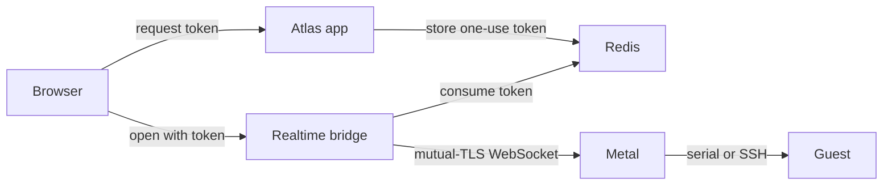

# Open a VM console

A console lets a person interact with a VM when normal network access is unavailable or inconvenient. Atlas checks access to the VM. Metal connects to the guest. The browser never connects to Metal or receives its client certificate.

## Follow the connection

In Desk, the VM form opens `/vm_console` with a token in the URL fragment. The fragment stays in the browser and is not sent with the page request. API callers can request a token with `POST /api/atlas/virtual-machines/{id}/actions/console-token`. The [Atlas API reference](/api/atlas/) gives the fields.

The browser sends the token to the Atlas realtime bridge. The bridge takes it from Redis in one operation, then opens a mutual-TLS WebSocket to the VM's Metal host.

The token is valid for **30 seconds** and works **once**. A reload cannot reuse it. Open a new console from the VM form, or request another token through the API. If Metal cannot be reached after the token is used, a new token is also needed.

## Choose a mode

| Mode | What you get | When it helps |
| --- | --- | --- |
| TTY, the default | The VM's shared serial console. Recent output replays when you attach. Several viewers can watch. | Inspect boot output or use the guest's serial login. |
| SSH | One new interactive session as `root`. It ends when this browser connection closes. | Get a normal shell in a running guest that supports Atlas SSH access. |

TTY output is collected while the VM runs, even with no viewer. A slow viewer is disconnected so it cannot block the guest.

SSH needs a reachable guest and its SSH service. Metal creates a temporary key for that session, adds it through the guest metadata service, and removes it when the session ends. [SSH key changes](ssh-keys.md) explains the guest's key lookup.

::: warning The console is access to the guest
The VM read permission allows a user to request a console token. Treat this permission as guest access, especially for SSH mode. A console token is a bearer credential until the bridge consumes it.
:::

## If the console does not open

Check that the VM is running, the token is new, and the assigned Metal host is reachable. For SSH mode, check that the guest image supports Atlas SSH keys and that its SSH service is running.

A TTY session can show boot errors when SSH is not ready. [Find a problem](../operate/find-a-problem.md) gives the next host checks.

::: details Source code and tests

- [VM permission check](../../atlas/vm/doctype/virtual_machine/virtual_machine.py) and [token store](../../atlas/vm/core/console_token.py) issue console access.
- [Desk console action](../../atlas/vm/doctype/virtual_machine/virtual_machine.js) and [browser terminal](https://github.com/frappe/atlas/blob/develop/atlas/www/vm_console.html) open the session.
- [Realtime bridge](../../atlas/realtime/handlers.py) consumes the token and forwards terminal data.
- [Metal console endpoint](../../metal/internal/api/vm_console.go), [serial mode](../../metal/internal/api/vm_console_tty.go), and [SSH mode](../../metal/internal/api/vm_console_ssh.go) join the guest.
- [SSH runtime](../../metal/internal/firecracker/ssh.go) owns the temporary key and session cleanup.

:::
