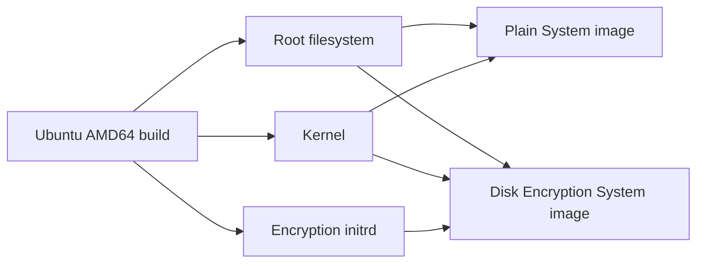
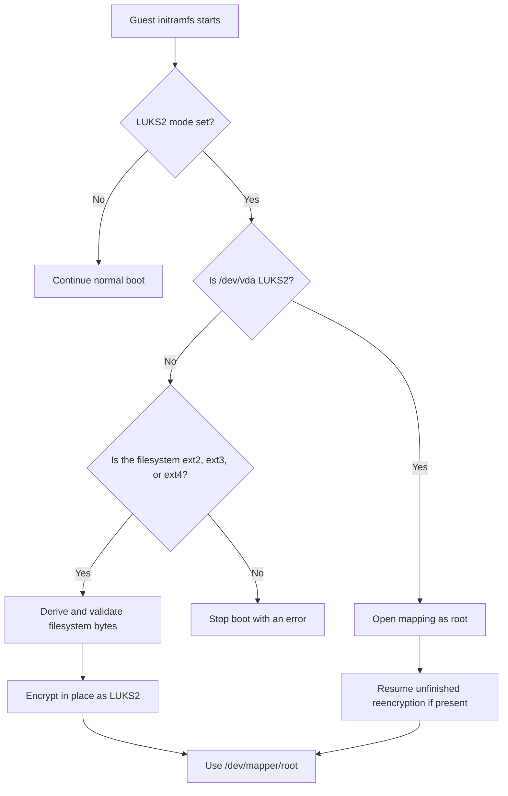
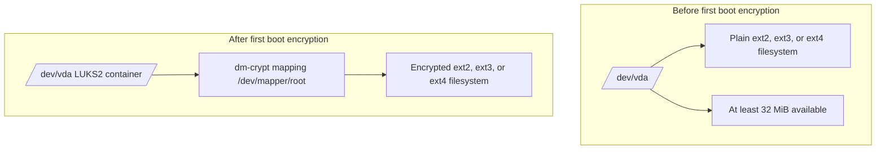
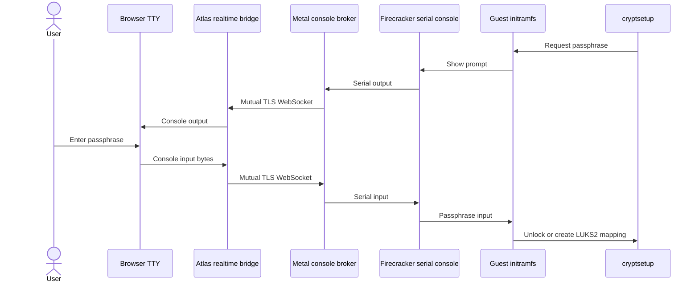

# Encrypt a VM root disk

Atlas can create an Ubuntu virtual machine (VM) whose root disk uses Linux Unified Key Setup version 2 (LUKS2). LUKS2 stores encryption metadata on the disk. The Linux `dm-crypt` subsystem encrypts and decrypts block device input and output.

The guest manages the encryption operation and the encryption key. Atlas and Metal prepare the boot artifacts and connect the serial console.

## Support boundary

The current disk encryption images support Ubuntu on AMD64. Each image contains `cryptsetup` 2.8.8.

The source root filesystem must be ext2, ext3, or ext4. The filesystem must start directly on `/dev/vda`, without a partition table.

The initial RAM disk (initrd) is the boot artifact that contains the early guest tools. The kernel unpacks it as an initial RAM filesystem (initramfs) before it mounts the root filesystem.

## Select an image variant

The Ubuntu image builder publishes two System image variants from the same root filesystem and kernel. The plain variant has no initrd. The disk encryption variant also has an initrd with `cryptsetup`, filesystem inspection tools, and the Atlas encryption script.



To create an encrypted VM, select the disk encryption image and enable disk encryption in the VM request. Atlas sends `luks2` as the encryption mode and includes the image initrd. Metal rejects an encrypted request that has no initrd.

The image record stores the root filesystem, kernel, optional initrd, architecture, sizes, and SHA-256 digests. It does not store a root filesystem byte boundary. The Metal image manifest and boot configuration do not store that boundary either.

## Understand component ownership

| Component | Responsibility |
| --- | --- |
| Atlas | Publishes both image variants, records the VM encryption choice, sends the LUKS2 mode and initrd metadata, and provides console access. |
| Metal storage | Downloads and verifies the artifacts, clones the root disk, grows the virtual disk, and links the kernel and optional initrd into the VM jail. |
| Metal Firecracker runtime | Requires an initrd for an encrypted boot and adds only `atlas.disk_encryption=luks2` to the kernel command line. |
| Guest initramfs | Detects the current disk format, derives the filesystem boundary, asks for the passphrase, encrypts or opens the disk, and selects `/dev/mapper/root` as the root device. |

An image cannot set the Atlas disk encryption kernel argument. Metal rejects an image that supplies this argument and adds the argument from the VM specification.

## Follow the boot decision

The initramfs encryption script does nothing when the kernel command line has no disk encryption mode. When the mode is `luks2`, it loads `dm_crypt` and checks `/dev/vda`.



### First encrypted boot

On the first encrypted boot, `/dev/vda` contains a plaintext ext filesystem. The initramfs identifies its type with `blkid` and stops if the type is not ext2, ext3, or ext4.

The initramfs runs `LC_ALL=C dumpe2fs -h /dev/vda` once. It requires exactly one `Block count` field and exactly one `Block size` field.

Both values must be positive decimal values with no more than 18 digits. The block size must be a power of two from 1024 through 65536 bytes.

The initramfs reads the disk capacity with `blockdev --getsize64 /dev/vda`. It first reserves 32 MiB for encryption metadata and then checks the filesystem geometry.

```text
usable bytes = device bytes - 32 MiB
maximum blocks = usable bytes / block size
require block count <= maximum blocks
filesystem bytes = block count * block size
```

This order checks the available space before multiplication. The initramfs stops if the values are missing, ambiguous, invalid, or too large for the disk.

The guest gives the derived filesystem byte count to `cryptsetup reencrypt`. It also tells `cryptsetup` to reduce the exposed device by 32 MiB. `cryptsetup` asks for the new passphrase twice and encrypts the existing filesystem in place.

Argon2id is a memory-hard passphrase derivation function. The new LUKS2 keyslot uses Argon2id with a 256 MiB memory cost.

The host does not calculate, send, or persist the filesystem byte count. The kernel command line contains the encryption mode only.

### Later cold boots

When `/dev/vda` is already LUKS2, the initramfs opens it as `/dev/mapper/root`. An incorrect passphrase starts another prompt. Other open errors stop the boot.

After the mapping opens, the initramfs asks `cryptsetup` to resume an unfinished reencryption operation. This recovers a first boot that stopped after encryption began.

The LUKS2 branch opens the mapping and handles reencryption recovery before any plaintext filesystem inspection. It does not run `blkid`, `dumpe2fs`, or `blockdev` against the encrypted disk.

## Understand the disk layout

Before encryption, the ext filesystem is directly on the root disk and leaves at least 32 MiB available. After encryption, `/dev/vda` is a LUKS2 container and the same ext filesystem is available through the decrypted mapping.



The diagram shows the logical layers. It does not show physical metadata positions on the disk.

## Enter the passphrase through the console

Open the VM console in TTY mode before the encrypted guest boots. TTY mode connects to the shared Firecracker serial console and shows the initramfs prompt.



Atlas uses its existing one-use console token and realtime bridge. Atlas and Metal forward the console input bytes. They do not store the passphrase in the VM record, image record, image manifest, or boot configuration.

The Metal host is trusted. It controls the serial connection, Firecracker process, VM memory, and local saved state. VM memory can contain an unlocked disk key.

Disk encryption protects data at rest from storage access. It does not protect a running or saved VM from its Metal host.

See [Open a VM console](console.md) for token use, permissions, and connection recovery.

## How does idle sleep work?

An encrypted VM can use automatic idle sleep. Metal saves its memory and device state under the VM directory and restores that state when guest-directed traffic arrives.

A VM-local restore resumes the unlocked guest state. It does not cold boot the guest or ask for the passphrase again. The saved state stays on the trusted host and can contain the unlocked disk key.

Shared warm boot is disabled for encrypted VMs. Metal does not start an encrypted VM from the reusable memory artifact of an image.

An explicit stop, restart, incompatible shape change, or saved-state removal causes a later cold boot. The user must enter the passphrase when the initramfs opens the disk.

See [Sleepy VMs](sleepy-vms.md) for idle detection, wake traffic, and saved-state recovery.

## Know the current restrictions

- Machine image capture is blocked for an encrypted VM.
- Shared warm boot is disabled for an encrypted VM.
- An encrypted cold boot needs an interactive TTY passphrase.
- The source filesystem must be ext2, ext3, or ext4 directly on `/dev/vda`.
- The source disk must leave at least 32 MiB for encryption metadata.
- The current supported build is Ubuntu on AMD64 with `cryptsetup` 2.8.8.

## Diagnose an encrypted boot

Use the TTY console to read initramfs errors. A boot stops near the cause when the encryption mode, initrd, disk format, filesystem geometry, available space, passphrase, or reencryption recovery is invalid.

If the VM does not prompt, confirm that the VM uses the disk encryption image, its request enables disk encryption, and the image has an initrd. If an existing encrypted disk does not open, retry the passphrase and inspect the first non-passphrase error on the serial console.

::: details Source code and tests

- [Ubuntu image builder](../../atlas/vm/scripts/build_ubuntu_server_image.sh) builds the AMD64 root filesystem, kernel, and encryption initrd with `cryptsetup` 2.8.8.
- [Image publisher](../../atlas/vm/core/image_builder.py) publishes the plain and disk encryption variants.
- [Atlas VM service](../../atlas/vm/core/vm_service.py) validates image support and sends the encryption mode and initrd to Metal.
- [Metal request validation](../../metal/internal/api/vm_request.go) accepts the LUKS2 mode and requires the initrd.
- [Metal image storage](../../metal/internal/storage/image.go) verifies the optional initrd, and [boot storage](../../metal/internal/storage/disk.go) links it into the VM jail.
- [Firecracker configuration](../../metal/internal/firecracker/machine_configuration.go) validates the boot configuration and adds the encryption mode.
- [Initramfs hook](https://github.com/frappe/atlas/blob/develop/atlas/vm/scripts/guest/initramfs/hooks/atlas-cryptroot) includes the required tools, and [initramfs boot script](https://github.com/frappe/atlas/blob/develop/atlas/vm/scripts/guest/initramfs/scripts/local-top/atlas-cryptroot) owns encryption and unlock.
- [Atlas console bridge](../../atlas/realtime/handlers.py) and [Metal TTY endpoint](../../metal/internal/api/vm_console_tty.go) forward the serial console.
- [Firecracker launch policy](../../metal/internal/firecracker/launch.go) excludes encrypted VMs from shared warm boot.
- [Machine image action](../../atlas/vm/doctype/virtual_machine/virtual_machine.py) blocks capture from an encrypted VM.
- [Initramfs test harness](../../atlas/vm/scripts/guest/initramfs/tests/atlas-cryptroot-test.sh) checks filesystem geometry, failure cases, passphrase retry, and reencryption recovery.
- [Firecracker configuration tests](../../metal/internal/firecracker/machine_configuration_test.go), [Firecracker machine tests](../../metal/internal/firecracker/machine_test.go), and [Metal VM manager tests](../../metal/internal/vm/manager_test.go) check boot arguments, warm boot exclusion, and VM-local restore.
- [Metal API tests](../../metal/internal/api/server_test.go), [Atlas VM service tests](../../atlas/vm/core/test_vm_service.py), and [Atlas VM tests](../../atlas/vm/doctype/virtual_machine/test_virtual_machine.py) check request validation, idle sleep, and Machine image capture.

:::
