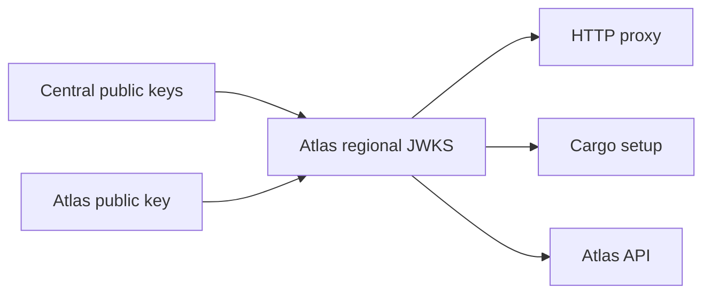

# Signing keys and tokens

Atlas, Central, and regional services use signed JSON Web Tokens (JWTs) for service calls. A public JSON Web Key Set (JWKS) lets a receiver check a signature without holding the signing key.

**A trusted key alone does not grant access.** Each receiver also checks who issued the token, which service it targets, when it expires, and what it permits.

## How keys reach a region



1. Atlas fetches and validates Central's public keys from the **Central JWKS URL** every 5 minutes. A failed fetch keeps the last valid set. Removing the URL clears that set.
2. Atlas creates one regional Ed25519 signing key. Its private half stays in an Atlas Settings Password field.
3. `/api/atlas/jwks.json` serves **Central's stored public keys plus the regional Atlas public key**. It never serves a private key.
4. Atlas uses that set for API tokens. The proxy fetches it using the configured URL. Atlas passes the URL to Cargo during installation.

The endpoint returns a JSON `keys` array. Each key has an Ed25519 public value, `EdDSA` algorithm, and namespaced `kid`. Atlas accepts 1 to 100 Central keys. It rejects private key fields, duplicate IDs, and unsupported key types.

::: warning One key set, separate permissions
The combined key set lets a service verify a Central or regional Atlas signature. It does not make a token valid for every service. A token for Atlas, the proxy, or Cargo needs that service's own audience and claims. Never use an Atlas API token as a proxy credential.
:::

Metal uses regional certificates and mutual TLS, not these JWTs. [The security model](security.md#metal-listeners) explains its listeners.

## Read a service token

A JWT has a signed header and claims. These fields define the service boundary:

| Field | Meaning |
| --- | --- |
| Header `alg` | `EdDSA`, using an Ed25519 key. |
| Header `kid` | `central:<key ID>` or `atlas:<region ID>:<key ID>`. Its prefix must match `iss`. |
| `iss` | `central` or this region's `atlas:<region ID>`. |
| `sub` | Caller label. It does not grant permission by itself. |
| `aud` | The one service this token is for. |
| `iat`, `exp` | Issue and expiry times as Unix seconds. `nbf` is checked when present. |
| `scope` | Operations the receiver permits. Each service defines its own values. |
| `tenant` | Required for Atlas API access. Forbidden on proxy JWTs. |
| `constraints` | Optional proxy limits on site or domain names. Atlas API tokens cannot carry nonempty constraints. |

An Atlas API token for tenant `7` in region `1` can have this decoded header and claim set. The actual token is the signed, encoded form of these values:

```json
{
  "header": {"alg": "EdDSA", "kid": "atlas:1:key-1"},
  "claims": {
    "iss": "atlas:1", "sub": "cargo", "aud": "atlas-admin:1",
    "scope": "*", "tenant": "7", "iat": 1789072323, "exp": 1789072623
  }
}
```

| Receiver | Required audience | Authority after signature check |
| --- | --- | --- |
| Atlas tenant API | `atlas-admin:<region ID>` | `scope=*` plus signed `tenant`. [Tenant identity](tenant-api.md) restricts records and `X-Tenant-ID`. |
| HTTP proxy control API | `atlas-proxy:<region ID>` | Signed `scope` and optional name `constraints`. No `tenant` claim. [Proxy authentication](../networking/http-proxy/control-daemon.md#authentication) defines the route rules. |
| Cargo API | `atlas-cargo:<region ID>` for Atlas's bucket request | Atlas issues `scope=*`, `tenant=0`. Cargo's own validation rules are outside this repository. |
| WireGuard gateway API | `atlas-wg-gateway:<region ID>` | Signed `scope` from `*`, `peers:*`, `peers:read`, `peers:update`, `gateway:read`. No `tenant` claim. The daemon validates against the Atlas JWKS like the proxy control daemon. |

For example, a Central caller needs a Central-signed token with the regional proxy audience and a permitted scope to change proxy routes. To call Atlas, it needs another token with the Atlas audience and a tenant claim. Atlas can also sign tokens for these services with its regional key.

A receiver rejects a token with a valid signature when its audience, issuer, expiry, or required claims do not match.

## What Atlas issues for Cargo

During Cargo installation, Atlas supplies two tokens. One lets Cargo call the Atlas API as tenant `0`. The other lets it update proxy site routes ending in `-svc`. Both last 365 days. The installer also receives the combined JWKS URL so Cargo can obtain public keys.

For a bucket request in the other direction, Atlas creates a short-lived token for the regional Cargo audience.

::: info Cargo integration boundary
The Cargo implementation is not in this repository. Its installer currently receives placeholder Central URL and webhook secret values. Check Cargo's own documentation before relying on Central-to-Cargo authorization or webhook behavior.
:::

## If access fails

Check the receiver's audience first. Then check the `kid` prefix, `iss`, signature key, expiry, and service-specific claims.

For Central tokens, check whether the most recent JWKS sync succeeded and whether the stored set contains that key ID. An unknown key ID does not trigger an immediate Atlas fetch. The [security model](security.md) lists other control boundaries.

::: details Source code and tests

- [Regional key set](../../atlas/auth/jwks.py), [Atlas issuer](../../atlas/auth/issuer.py), and [Atlas token validator](../../atlas/auth/token.py) own signing and verification.
- [Atlas settings](../../atlas/atlas/doctype/atlas_settings/atlas_settings.py) defines issuer, audiences, and JWKS URL.
- [Proxy configuration](../../atlas/service/core/proxy/configuration.py) passes the URL and accepted issuers. [Proxy authentication](../../services/http-proxy/control/proxy_control/auth.py) checks the token claims.
- [Cargo installation](../../atlas/service/core/cargo/provisioning.py) passes the URL and two service tokens. [Bucket request](../../atlas/service/core/cargo/bucket.py) issues the Cargo token.
- [JWKS tests](../../atlas/auth/test_jwks.py), [Atlas token tests](../../atlas/auth/test_token.py), and [proxy authentication tests](../../services/http-proxy/control/tests/test_auth.py) check the boundaries.

:::
