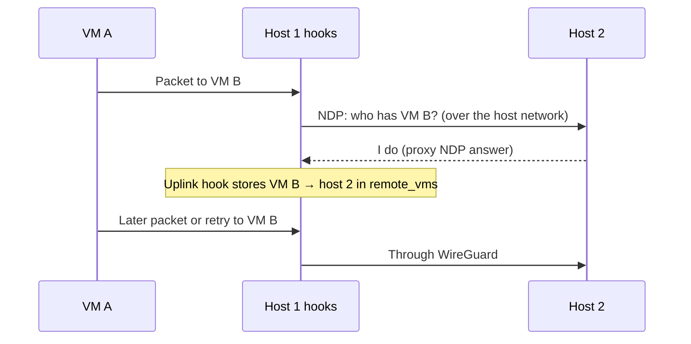

# How VMs reach each other

Each VM has a private IPv6 address. WG Mesh lets VMs find and reach each other across hosts without a controller that tracks every VM location. Privileged VMs use the same network to serve tenants. Gateway VMs can carry packets from outside it.

The [architecture](../start/architecture.md#build-the-system-from-the-bottom-up) shows how services use these blocks.

## The location problem

Atlas chooses a host when it creates a VM, but the other hosts still need to find that VM before they can send it a packet. Its private address identifies the VM, not its physical host. The same problem occurs after a migration because the VM keeps its address while its host changes.

A central location controller would have to publish every VM location to every host and update them all after each move. A failed update could leave hosts sending to the old location.

WG Mesh lets a sender ask the host network who owns the destination address. The host running that VM answers through Neighbor Discovery Protocol (NDP). The sender remembers the answer and uses WireGuard for later packets.

Atlas still assigns VM addresses and syncs the host peer list and access policy. It does not distribute a VM-to-host map. The HTTP proxy, IPv6 router, and other service VMs can therefore use the same network without maintaining their own location map.

## Three layers

| Layer | Addresses | Job |
| --- | --- | --- |
| 1. Host network | Provider private IPv4 | The provider's private network carries traffic between hosts. |
| 2. WireGuard | `fdab::/16`, one per host | Encrypts all traffic between hosts. |
| 3. WG Mesh | `fdaa::/16`, one per VM | eBPF decides where each VM packet goes. |

Each layer uses the one below it. A VM never sees the host tunnels or the provider's private network.

## Layer 1: the host network

The provider gives the hosts of a region a private network. Network code calls this the **underlay**. It moves packets between hosts. VM traffic goes through WireGuard before it crosses this network. Host location lookups use the network directly.

## Layer 2: WireGuard between every host

Each host has a WireGuard interface, `wg0`, with an address in `fdab::/16`. Every host has a tunnel to every other host in the region over the private host network.

The Atlas app keeps the list of hosts and their keys. It sends the complete peer list to each host during [host sync](../region/host-sync.md), and Metal applies it. A new host joins the mesh at the next sync.

## Layer 3: WG Mesh

Each VM gets a stable address. The Atlas app derives it when it creates the VM:

```text
fdaa : region : tenant : VM number
```

For example, `fdaa:1:0:2::3` is VM `3` of tenant `2` in region `1`.

The address stays with the VM when it moves. WG Mesh checks a learned host location for each packet and starts a lookup when it has no valid entry.

WG Mesh is not a server. It is a set of small eBPF programs on each host's network interfaces:

| Hook | Runs on | Job |
| --- | --- | --- |
| VM hook | Traffic leaving each VM | Check the packet, then deliver it, tunnel it, or look up the destination. |
| WireGuard hook | Traffic arriving on `wg0` | Unwrap the packet and deliver it to the local VM. |
| Uplink hook | The private uplink | Record which host answered a lookup. |

The hooks share lookup tables called eBPF maps. `local_vms` lists the VMs on this host. `remote_vms` remembers the host of each remote VM that this host has talked to.

### Find a VM for the first time

When `remote_vms` has no entry, the host uses NDP to ask which host has the VM address.



The host that runs VM B answers for it with proxy NDP. The first packet becomes the lookup, so a later packet or transport retry uses the learned location. If the host network cannot carry multicast, unicast mode sends each lookup to every peer inside an IPv4 packet instead.

### Send later packets

1. The VM hook checks the source and the tenant (see below).
2. If VM B is on the same host, Linux delivers the packet.
3. If `remote_vms` knows VM B's host, the hook wraps the packet in a host-to-host packet and sends it through WireGuard.
4. The destination host's WireGuard hook removes the wrapper and delivers the packet to VM B.

### When a VM moves

The new host announces the VM's address to all hosts, so they update `remote_vms` at once. If a host missed the announcement and sends to the old host, the old host replies `NOT_HERE`. The sender drops the old entry and looks the VM up again.

## Tenant isolation and privileged VMs

The VM hook reads the tenant part of both addresses. **VMs of different tenants cannot talk to each other.** The hook also drops a packet that uses an address the VM does not own. It drops any packet aimed at the host range `fdab::/16`.

A **privileged VM** is a tenant-0 VM that can talk to every tenant. Atlas sends the list of privileged VMs during host sync. Only Atlas can grant this, and only to tenant-0 VMs. It suits regional services:

| Privileged VM | Why it needs every tenant |
| --- | --- |
| HTTP proxy | Sends each site's traffic to that site's VM. |
| Cargo | Monitors usage across tenants. |
| IPv6 router | Carries public IPv6 traffic for every tenant's VMs. |
| WireGuard gateway | Carries each customer's tunnel into that customer's own tenant VMs. |

## Gateway routes

A gateway route tells Atlas where one VM sends traffic for a destination prefix. A route can use the host uplink or a gateway VM's mesh address. Atlas saves the route with the VM network request, and Metal applies it on the host.

| Example route | Result |
| --- | --- |
| `0.0.0.0/0` via `host` | IPv4 leaves through the host uplink. |
| `2000::/3` via `fdaa:1::56` | Public IPv6 goes through gateway VM `fdaa:1::56`. |

WG Mesh chooses the longest matching gateway route. A route to a gateway works for IPv6 destinations because the gateway is reached through the IPv6 mesh. IPv4 routes use `host`. [Metal host networking](host-networking.md#choose-an-outbound-route) gives the exact request rules.

### Edit routes

Use **Actions > Edit Routes** on a VM. Atlas reads the current desired routes from Metal when it opens the editor. Saving replaces the full route list under a VM network lock. Atlas reads Metal because public IP jobs can change routes after the VM was created. A stale Atlas copy could erase those changes.

An attached public IPv4 address needs `0.0.0.0/0` via `host`. An attached public IPv6 address owns its `2000::/3` route. Detach the address before you remove or change its required route.

::: info The route also guards inbound traffic
When a gateway forwards a packet with an outside client address, WG Mesh checks the target VM's return route. If the VM has no gateway route for that client address, the mesh drops the packet. A route therefore selects outbound delivery and permits the matching inbound reply path.
:::

## Network gateway VMs

A **network gateway** is a privileged VM that carries traffic the mesh does not own. Its own software forwards, translates, or filters packets. The [IPv6 router](ipv6-router.md) is Atlas's managed gateway today. The gateway role lets it keep the real client address. The [packet example](wg-mesh/gateways.md#how-the-packet-changes) shows what the guest sees and how the reply returns.

When Atlas attaches a routed public IPv6 address, it adds the VM's `2000::/3` route to the router. It removes that route on detach. The route also tells WG Mesh whether to admit inbound client packets. [Gateway VMs](wg-mesh/gateways.md) explains the full packet path.

## Who does what

| Part | Role |
| --- | --- |
| Atlas app | Assigns VM addresses. Sends peers and privileged VMs during host sync, and gateway routes with each VM's network settings. |
| Metal | Applies WireGuard peers and connects each VM's interface to the mesh. |
| WG Mesh | Decides, for each packet, to deliver, tunnel, look up, send to a gateway, or drop. |

## Limits

- The first packet to a new or moved VM can be lost. Clients retry.
- NDP trusts the private network. It does not authenticate hosts on its own.
- The mesh covers one region. It does not connect regions.

For packet rules and maps, read the [WG Mesh design](wg-mesh/index.md). For host checks, use the [operations guide](wg-mesh/operations.md).
