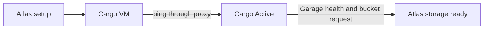

# Cargo service

Cargo runs Pilot, usage monitoring, and Garage storage in one regional service VM. Atlas creates the VM, publishes two web routes, and asks Cargo for an object-storage bucket. Cargo's own implementation is outside this repository.

## Before you provision

Use the **Provision** action on Cargo Server. Select an Available System image and a reserved tenant-0 IPv4 allocation. An Active HTTP proxy must already exist because Cargo's public routes go through it.

| Resource | Provision form default |
| --- | --- |
| Cargo VM | 2000 CPU millicores, 4096 MiB memory, 16384 MiB disk. |
| Garage | Three storage nodes, three copies, one gateway. |
| Storage node disk | 500 GB. |

The storage-node count must be at least the replication factor. The [service VM guide](service-vms.md) explains the shared VM and status model.

## Follow the setup

Atlas waits for the VM to leave draft state. A job then runs these steps:

1. Wait for root SSH through the VM host.
2. Run `install-cargo.sh` in a synchronous SSH Task.
3. Point `cargo` and `cargo-pilot` proxy routes at the VM's mesh IPv6 address.
4. Call Cargo's ping endpoint through the regional proxy and expect `pong`.
5. Set Cargo Server to `Active` and queue the Atlas bucket request.

The installer receives Atlas and proxy tokens, the [combined JWKS URL](../interfaces/signing-keys.md), region values, and Garage cluster settings. See [Cargo token values](../interfaces/signing-keys.md#what-atlas-issues-for-cargo) for scopes and lifetimes.

::: info What Active means
`Active` proves that Cargo answered its ping through the proxy. It does not mean Garage is healthy or the Atlas bucket exists. Check Atlas Settings for object-storage credentials before you depend on image uploads.
:::

## How the Atlas bucket appears

After Cargo becomes Active, Atlas checks Garage through `s3-admin-svc.<wildcard-domain>/health`. If Garage is ready, Atlas requests `atlas-<region-name>` from Cargo and stores the returned key in Atlas Settings. It uses that key for the `s3-svc.<wildcard-domain>` endpoint.

The bucket job runs again each minute while Cargo is Active and Atlas object storage is unset. Atlas does not replace configured object storage. Clearing existing storage fields can make objects in the old bucket unreachable. [Image records](../storage/image-records.md) explains bootstrap image migration after storage is available.

## Operate and recover

| Action or symptom | What to do |
| --- | --- |
| Failed setup | Read the Failure phase and the installation SSH Task. Correct the cause, then **Archive** and **Provision** again. |
| Archive fails to remove a proxy route | Keep the attached VM. Correct the proxy fault and retry **Archive**. |
| Reset Pilot admin password | Select **Reset Pilot Admin Password** on an Active Cargo Server. Atlas shows the new password once and does not keep it. |
| Build new Pilot images | Enable **Auto Build Pilot Images** only after object storage and bootstrap image migration are ready. |

The installation SSH Task retains command output and generated credentials for System Managers until the VM is deleted. Cargo service tokens last 365 days and have no revocation record. The Central URL and webhook secret passed to the installer are placeholders. Atlas does not configure Cargo's Central connection.

::: details Source code and tests

- [Cargo Server](../../atlas/service/doctype/cargo_server/cargo_server.py) owns the single VM, actions, and archive rules.
- [Cargo provisioner](../../atlas/service/core/cargo/provisioning.py) installs Cargo and checks the proxy route.
- [Bucket job](../../atlas/service/core/cargo/bucket.py) waits for Garage and stores credentials.
- [Cargo tests](../../atlas/service/doctype/cargo_server/test_cargo_server.py) cover creation and recovery.

:::
