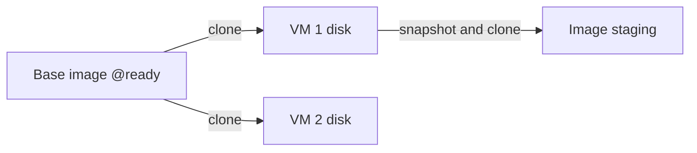

# Host storage

Metal stores VM disks in ZFS and keeps records and artifacts under `/var/lib/metal`. The Atlas app owns image identity and object storage. Metal owns everything on the host. Host setup creates the ZFS pool before `metald` starts, and the `zfs.pool` setting names it.

## How disks are built

Every VM disk is a copy-on-write clone of an image, so creating a disk is almost instant and costs no space until the VM writes.

| Dataset | Holds |
| --- | --- |
| `<pool>/images/<image-ref>` | Base volume with a `@ready` snapshot, the source of VM disks. |
| `<pool>/vms/<vm-id>` | One VM disk clone. The VM ID matches `machines/<vm-id>`. |
| `<pool>/staging/<snapshot-id>` | Read-only Machine image upload source. |
| `<pool>/warm/<key>@ready` | Warm boot disk for one image and exact VM shape. |
| `<pool>/state` | File system mounted at `/var/lib/metal`. Downloads, warm memory, and saved state use pool space, not the root disk. |

## Files on the host

Metal keeps VM records, image files, and staging under `/var/lib/metal`. The [host layout](host-layout.md) shows every file and dataset.

## Prepare a VM disk

1. Download the image and verify architecture and SHA-256 digests.
2. Import a base ZFS volume.
3. Create a copy-on-write clone of its ready snapshot.
4. Grow the clone if the requested disk is larger.

Metal never shrinks a disk. Different content under an existing image reference conflicts.

## Snapshots and warm artifacts

| | Machine image snapshot | Warm artifact |
| --- | --- | --- |
| Contents | Disk and kernel. | Disk, guest memory, and Firecracker state. |
| Purpose | Publish an image through Atlas. | Skip boot for an exact image and VM shape. |
| Transfer | Signed multipart upload. | Stays on the host. |

**A Machine image snapshot is not a VM rollback point.** Metal has no restore or promote operation. Atlas creates a new VM from the published image.

Metal creates the snapshot ID shared with Atlas. A read-only staging clone keeps upload contents stable. Progress is saved, missing parts retry after restart, and upload activity extends staging life.

## Limit disk IO

Set `disk.throughput_mibps` and `disk.iops`. Each covers reads and writes together. `0` means unlimited.

Metal applies Firecracker drive limiters and can update a live VM. It does not use cgroup IO limits: ZFS schedules its own IO, so block-device limits do not hold per dataset.

## Keep and remove cached images

Host sync supplies image cache policy. Metal keeps each image that the policy caches.

Metal removes an image that the policy does not cache one hour after its last VM start. This includes an image whose `cache_image` setting was turned off. A new image that no VM started from ages from its download time.

When a cached image no longer requests a memory snapshot, Metal removes its unused warm artifacts.

A VM disk clone keeps its source image and warm disk until the VM is removed. Metal can build a new warm artifact while an old warm disk stays in use.

An existing VM clone can keep an image dataset in use after policy stops requesting it.

## Limits and recovery

Check free storage before downloads, staging, migration, or warm-artifact work. If a ZFS capacity check fails, Metal does not invent a capacity value.

Keep partial staging for retry. Before removing a dataset, confirm that no VM or staging clone still uses it.

## Experimental

The file-backed ZFS setup script is for development only. Normal installation uses a pool device selected by host setup.

::: details Source code and tests

- [Storage specification](../../metal/internal/storage/SPEC.md) maps image, disk, snapshot, and pool ownership.
- [Storage construction](../../metal/internal/storage/stores.go) creates the local stores.
- [Image store](../../metal/internal/storage/image.go) checks artifacts and cache policy.
- [VM disk store](../../metal/internal/storage/disk.go) prepares and releases disks.
- [Snapshot staging](../../metal/internal/storage/staging.go) and [upload](../../metal/internal/storage/image_upload.go) prepare machine images.
- [Experimental ZFS script](../../metal/internal/vm/scripts/zfs-setup.sh) labels its file-backed pool as experimental.

:::
