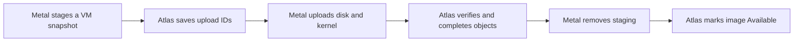

# Images and snapshots

Atlas keeps the list of images and stores their files in object storage. Metal downloads images to each host and builds VM disks from them. A snapshot goes the other way: from a VM disk to a new image.

## Create and transfer an image

### Boot from an image

1. Atlas sends the image reference, architecture, sizes, checksums, and download URLs.
2. Metal verifies the kernel and root filesystem and imports a base ZFS image.
3. Metal clones the base image's ready snapshot for the VM disk.

A reference is immutable on a host: different content under the same reference conflicts. Atlas can request cached images through host sync.

### Publish a Machine image

Atlas saves upload IDs **before** it requests the upload. It saves completed digests **before** it deletes Metal staging.

An image becomes `Available` only after Atlas completes the objects and removes staging. Metal finishing the upload is not enough.

### Warm artifacts stay local

A warm artifact contains guest memory and matching disk state. Shared warm memory is valid only for a first boot with a fresh disk clone.

A later start cold-boots the VM's existing disk. The [staging incident](../incidents/2026-09-24-guest-disk-corruption.md) explains this restriction.

## Failure and recovery

| Image state | Retry behavior |
| --- | --- |
| `Pending`, `Uploading`, `Completing`, `Cleaning` | Atlas retries through its pending-job scan. |
| `Failed` | Keeps the error and upload IDs for inspection. The normal scan does not select it. |

Metal preserves staging and upload progress. Correct object-storage access, expired URLs, capacity, or host errors before retry. Keep active staging and never log signed URLs.

**Details:** [Atlas image records](image-records.md), [Metal storage](host-storage.md), [Atlas API](/api/atlas/), and [Metal snapshot API](/api/metal/).

::: details Source code and tests

- [Atlas image transfer](../../atlas/vm/core/vm_image_transfer.py) owns image status, upload IDs, and publication.
- [Multipart upload service](../../atlas/vm/core/multipart_upload.py) owns object-storage completion.
- [Metal image store](../../metal/internal/storage/image.go) downloads and verifies bases.
- [Metal staging](../../metal/internal/storage/staging.go) and [upload](../../metal/internal/storage/image_upload.go) own local snapshot transfer.
- [Firecracker start](../../metal/internal/firecracker/machine.go) enforces the fresh-disk warm rule.
- [Image record tests](../../atlas/vm/doctype/virtual_machine_image/test_virtual_machine_image.py) and [Metal machine tests](../../metal/internal/firecracker/machine_test.go) check retry and boot rules.

:::
