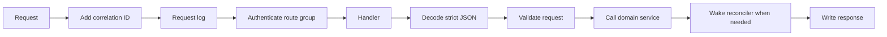

# api: Metal HTTP server

For Go code, follow the repository [Go anti-pattern rules](../../../llm/go-code-review-guide.md).

[internal SPEC](../SPEC.md) · endpoint guide: [docs/api.md](../../docs/api.md)

## Purpose

Almost nothing here waits for the host. A mutation validates its request, stores desired state, wakes the reconciler, and returns. The controller learns the outcome by polling, not by holding a connection open.

That is why this package is thin: it owns request validation, the public response shape, and the mapping from domain errors to status codes. It owns no VM, image, or host state.

## Types

`New(Config, Dependencies)` returns the Atlas API router. `NewCoordination` returns the node coordination router. `Server` holds the injected services and handlers.

`Dependencies` carries the VM manager, migration manager, snapshot store, host service, wake function, serial broker, and trusted key store. Each is an interface declared here, so this package depends on no implementation.

## Request flow



Correlation runs first, so every log line and every error carries the same IDs. Each request gets an `X-Request-ID` and an `X-Operation-ID`, returned as response headers and included in logs. A caller-supplied value is kept when it is safe to echo, and replaced when it is not.

JSON decoding is strict: unknown fields and trailing values are rejected, so a misspelled field fails instead of being silently dropped. Bodies are size capped.

## Routes

```text
GET    /health                    public
GET    /docs                      public
GET    /docs/swagger.json         public

POST   /v1/sync

PUT    /v1/vms/:id                create, idempotent on the caller's ID
GET    /v1/vms
GET    /v1/vms/:id
PUT    /v1/vms/:id/power
POST   /v1/vms/:id/restart
PUT    /v1/vms/:id/compute
PUT    /v1/vms/:id/disk
PUT    /v1/vms/:id/network
PUT    /v1/vms/:id/ssh-keys
PUT    /v1/vms/:id/metadata
DELETE /v1/vms/:id
GET    /v1/vms/:id/console        mode=tty (default) or mode=ssh

POST   /v1/vms/:id/snapshots
POST   /v1/snapshots/:id/upload
GET    /v1/snapshots/:id
DELETE /v1/snapshots/:id

PUT    /v1/migrations/:id          Atlas creates or resumes a destination
GET    /v1/migrations/:id          Atlas reads destination status
POST   /v1/migrations/:id/abort    Atlas aborts a destination
POST   /v1/migrations/:id/finish   Atlas records the destination finish
```

The coordination server on port 9001 has these routes:

```text
PUT    /v1/migrations/:id/source   the destination locks the source
POST   /v1/migrations/:id/snapshot the destination asks for the next snapshot
POST   /v1/migrations/:id/stream   the destination starts the one-shot snapshot server
POST   /v1/migrations/:id/stop     the destination acknowledges its last snapshot and stops the source
POST   /v1/migrations/:id/start    the destination restores the source during rollback
POST   /v1/migrations/:id/destroy  the destination destroys the stopped source
DELETE /v1/migrations/:id          the destination unlocks the source
```

Atlas drives create, get, abort, and finish on port 9000 with its client certificate. A destination host drives the source routes on port 9001 with a regional node certificate. Every source route carries the VM ID as the `virtual_machine_id` query value. Snapshot bytes use a separate mutual-TLS connection on port 9002. See [internal/vm/migration/SPEC.md](../vm/migration/SPEC.md).

The stop route normalizes the source to stopped, removes its network, and returns the final snapshot in the snapshot response form. It is idempotent.

The finish route records the destination finish request and returns `202`. The destination then destroys the source with the destroy route over the mesh. The destroy route removes the stopped source and returns `204`. The start route restores the source to its original desired state during a rollback and returns `204`.

PUT is used wherever a request replaces desired state, so a repeat is safe. POST is used only for an action that must happen again even when nothing changed, such as a restart, or for creating an addressable resource, such as a snapshot.

The network PUT requires the complete network object, including `firewall`. Firewall rules are allow rules. The API validates protocols, ports, canonical IP prefixes, and the limit of 50 prefix entries.

## Capacity

Compute and disk updates are checked against host memory and storage before they are stored, and an increase the host cannot satisfy is refused with `409` and the code `insufficient_capacity`. Atlas reads that code as a request to move the VM to another host. Only the increase is checked, because the VM already holds what it reserves. CPU entitlement is oversubscribed, so a CPU increase is always accepted when `cpu_millicores` is in the valid range from 100 through 32000.

Nothing else is checked this way: the remaining fields do not consume a host resource.

## Status codes

| Code | Meaning |
|---|---|
| `200` | The request completed synchronously. |
| `201` | A snapshot exists. `Location` names where to fetch it. |
| `202` | Desired state is stored. Reconciliation continues. |
| `204` | Removed, with nothing to return. |

SSH key and metadata replacement try to reach a live guest first, within a short timeout, and report `200` when they succeed. A timeout is not a failure: the desired record is already stored, so `202` means the next reconcile pass applies it. The timeout belongs to [internal/vm/SPEC.md](../vm/SPEC.md).

## Authentication

Each route group names the middleware it needs, so a route cannot inherit the wrong rule.

| Middleware | Credential | Routes |
|---|---|---|
| mutual TLS | The Atlas client certificate. The listener requires it and pins its common name. | The Atlas API server and every `/v1` route. |
| mutual TLS | A node certificate from the regional Metal authority. | The coordination server and its source-side migration routes. |

Each TLS listener verifies the client certificate before its router receives a request. This package holds no credential. A source route then reads the VM ID from the `virtual_machine_id` query value.

Group authentication makes the group answer every path below it. An unknown path and a wrong method under `/v1` both return `404`.

Liveness and the documentation sit outside `/v1`, but the Atlas API listener still requires the Atlas client certificate.

## Errors

A domain error is mapped to one status and one safe message. An unrecognized error becomes `500` with no detail, and its cause is logged under the request ID the response carries back.

| Domain error | Status | Code |
|---|---|---|
| `vm.ErrNotFound`, `storage.ErrNotFound` | `404` | `not_found` |
| `vm.ErrConflict`, `storage.ErrInUse` | `409` | `conflict` |
| Compute or disk increase without host capacity | `409` | `insufficient_capacity` |
| `storage.ErrImageConflict` | `409` | `image_content_conflict` |
| `storage.ErrImageIntegrity` | `422` | `image_integrity_failed` |
| `storage.ErrShuttingDown` | `503` | `unavailable` |
| `network.ErrInvalidPeers`, `storage.ErrInvalidUpload` | `400` | `invalid_request` |
| `token.ErrUnauthorized` | `401` | `unauthorized` |
| `token.ErrForbidden` | `403` | `forbidden` |
| `token.ErrInvalidKeys` | `400` | `invalid_request` |
| `token.ErrKeyConflict` | `409` | `conflict` |

Every error body carries a `retryable` flag, so a caller does not have to know which statuses are worth another attempt. `501` is excluded: repeating it cannot change the answer.

`POST /v1/sync` addresses no resource, so it maps a not-found from host state to `503` `unavailable`. A `404` would tell the controller to stop when it must try the request again.

Responses never carry host command output, signed URL query values, or local error detail.

## Response shape

A VM response nests `desired` and `observed`. The controller compares their generations to know when a change is applied, so both are always returned together.

A response omits what the controller must not see or cannot use: transport URLs, user data, host paths, process IDs, and host user IDs.

## Related

- [docs/api.md](../../docs/api.md) gives request and response details.
- [internal/vm/SPEC.md](../vm/SPEC.md) defines the VM contracts and the generation model.
- [internal/console/SPEC.md](../console/SPEC.md) owns the serial console the tty mode attaches to.
- [internal/vm/migration/SPEC.md](../vm/migration/SPEC.md) owns the host-to-host migration transport.
- [cmd/metald/SPEC.md](../../cmd/metald/SPEC.md) injects server dependencies.
