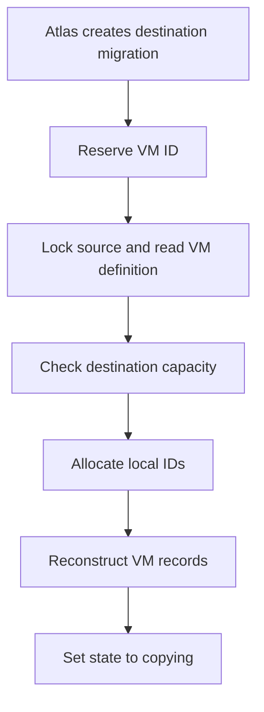
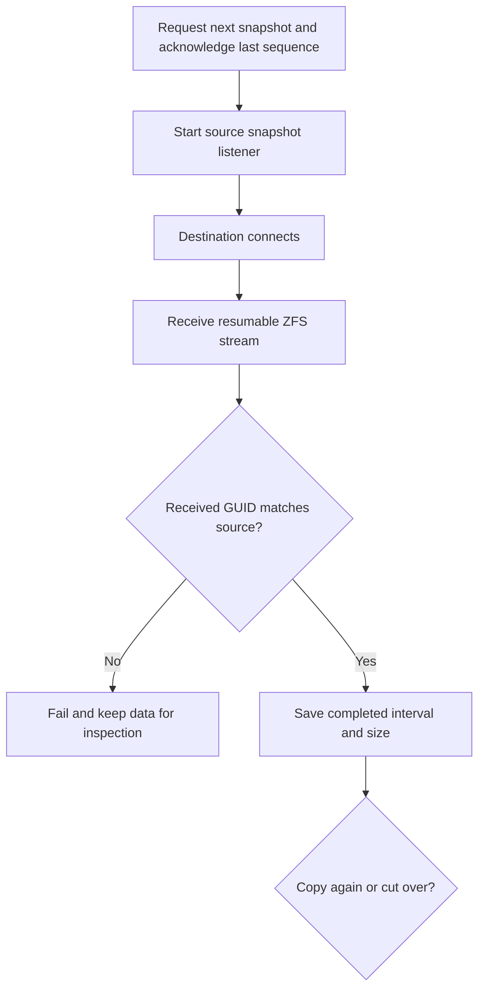
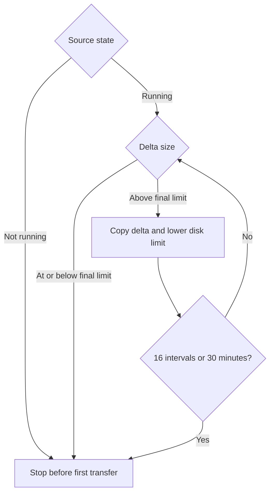
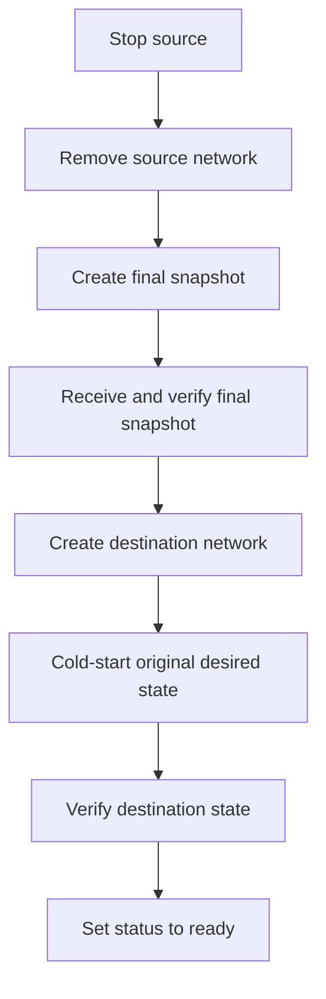
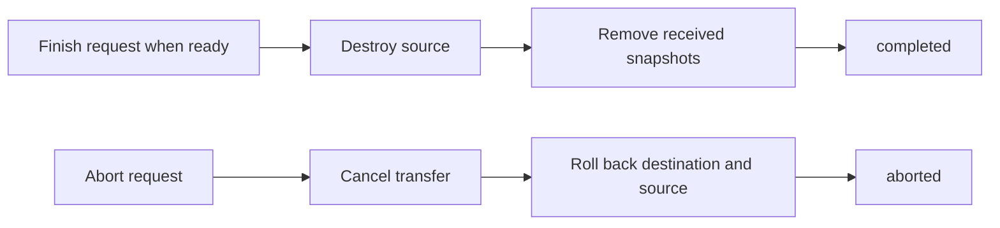
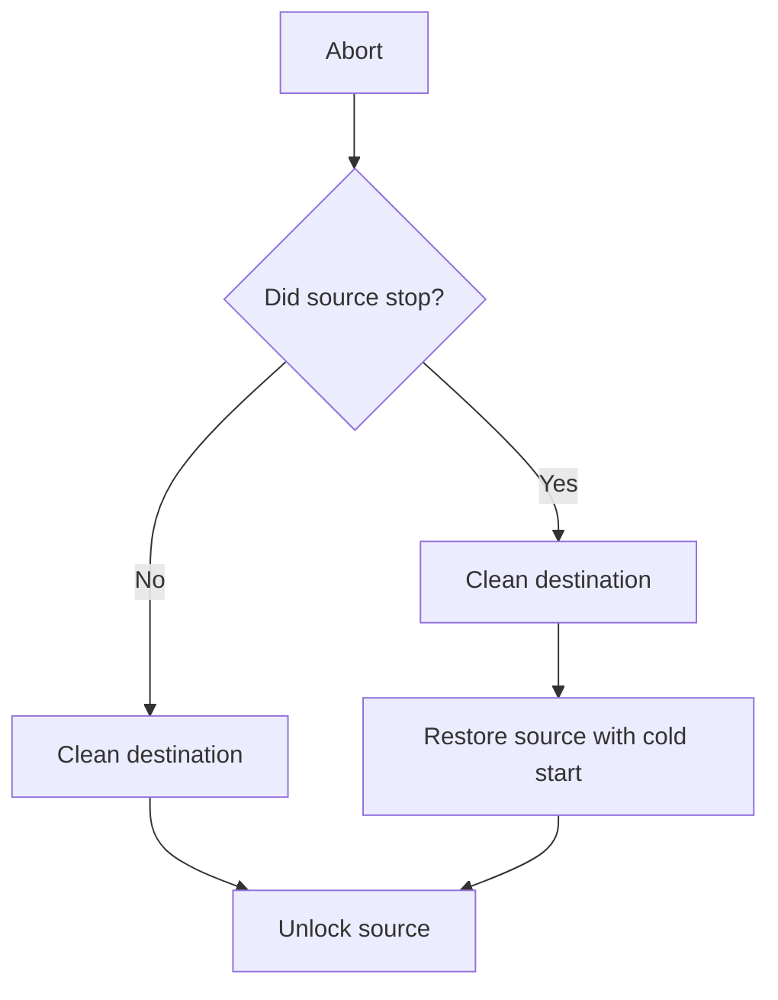
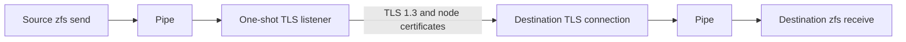

# VM migration

The `migration` package owns VM live migration on a Metal host. `Manager` is the public lifecycle entry point.

## Ownership

`Manager` stores migration records beside VM records and runs one worker per VM. `vm.MigrationHost` owns the VM operations that migration can use. `storage.MigrationTransfer` owns snapshot and dataset transfer operations. See [Boundary](#boundary).

```text
machines/<vm-id>/config.json            the VM's own records (vm package)
machines/<vm-id>/status.json
machines/<vm-id>/migration/destination.json  destination reservation and state
machines/<vm-id>/migration/source.json  source lock
```

One VM ID locates all VM state. A source record blocks VM changes and reconciliation. A destination record reserves the VM ID, hides the VM from list and get, and pauses reconciliation. A migration ID is different from a VM ID, so the destination scans records to find the VM.

## Preparing



The create request can carry an optional `resize`. The destination then replaces the CPU, memory, and disk size of the source definition before the capacity check, so it checks, reserves, and reconstructs the resized shape. A resize never shrinks the disk. A retry must repeat the same resize, or it returns `409`. The destination grows the received disk to the resized size before it applies the VM state.

```json
{
  "virtual_machine_id": "vm-1",
  "source": "https://10.0.0.3:9001",
  "resize": {"cpu_millicores": 4000, "memory_mib": 8192, "disk_mib": 40960}
}
```

The destination reserves compute only after the source supplies the VM definition. One host allocation lock covers the capacity check and the saved reservation. Host capacity subtracts that reservation while the destination stays out of the VM list. A destination that stays in `preparing` for 10 minutes expires. The destination then aborts the source and releases the reservation.

## Copying

During copying, `Manager` runs one disk transfer per VM and waits for transfers at shutdown. The reconciler starts or resumes it through `AdvanceDestination`. The reconciler does not move data. The transfer holds no VM lock while data moves. It continues from the saved destination state.

An HTTP request, the transfer worker, and the reconciler all change the destination record. Every read-modify-write of that record holds the migration lock of its VM. A caller that already holds the lock writes through `writeDestination`. Every other caller uses `mutateDestination`, which takes the lock, reads the stored record again, applies the change, and writes it. The worker therefore cannot write a copy it read before a long operation and drop an abort that arrived in the meantime. The lock is held only for the read and the write, so an abort stays available while data moves. The lock is not reentrant, so a locked caller must not call `mutateDestination`. An interval completion and a transfer failure detach the context, because the snapshot or the reason is already real when the worker stops.



The source keeps the acknowledged snapshot as the next incremental base and removes the previous one. The destination saves each interval before transfer, then saves its finish time and result after transfer. A record write error ends the transfer pass and reports the storage error. A stopped source needs one full interval. A network break or restart resumes the same sequence. A GUID mismatch, invalid sequence, or wrong destination dataset fails the migration and keeps the data for inspection.

## Cutover

A running source always sends the first full interval while it runs. For each later delta the destination compares its size with `migration.final_delta_mib`.



The destination sends the temporary limit on the stream header. The source applies the lower of that limit and the configured disk limit, and never raises an existing limit.

The stop request acknowledges the last completed interval. The source creates the final snapshot after the highest acknowledged sequence.



A source that is not running sends its whole disk as the final snapshot, so the destination reports `copying` until it arrives.

The source is stopped before the final snapshot. A running VM stops. A paused VM resumes, then stops. A created VM stops without guest work. A stopped VM with saved state restores, then stops. Saved memory is not transferred. The destination cold-starts the disk and keeps the record at `ready` until Atlas commits.

The source stop, network removal, final snapshot, destination network, and destination state are checkpointed before the next external operation. A restart repeats only safe work. A failure after the source stops marks the migration failed and keeps both hosts locked with snapshots for rollback.

## Completion and recovery

One cancellable background worker per VM drives finish and abort as well as the transfer. Atlas records a request on the destination, which wakes the worker.



A finish and an abort are mutually exclusive. The first request wins. A finish is valid only after the destination reports ready.



Rollback removes the destination runtime, network, dataset, and staging records. It aborts a partial receive before it removes the dataset. It creates the destination network only after the source network is gone. A stopped source is restored with a cold start and then unlocked. A rollback failure keeps both records, locks, and the source disk in a rollback state.

The source stops any active disk stream before it unlocks or destroys the VM. This releases the migration snapshot before unlock removes it.

A source lock that the destination stopped using for 15 minutes releases itself. The reconciler expires it only when the source never stopped, no stream is in flight, and no source control call arrived in that window. An age alone is not enough, because one long interval makes no control call. The release runs the same cleanup as an unlock and leaves the record as a tombstone with `expired`, which frees the VM but refuses the same migration ID, so a destination that comes back cannot resume against a VM the operator has since changed. A source that already stopped is never released here: the destination may have started the guest, and two hosts must never own one disk.

A nonterminal destination that Atlas stops calling for 15 minutes rolls itself back. It records the time of each Atlas control call, and Atlas gives a destination up after its own 10 minute visibility timeout, so nothing else would ever release the reservation, the dataset, and the hidden VM ID on that host. A `ready` destination is never released this way, because Atlas may already point the VM at it.

A success or abort keeps a terminal record with the schema version, migration ID, VM ID, state, and finish time. It hides no VM and reserves no capacity. Every nonterminal record holds its VM ID. Active destination states reserve capacity after the source supplies the VM definition. A failed destination does not reserve capacity. A new destination migration can replace an aborted record only after all VM, source lock, and destination dataset records are gone.

The daemon refuses to start when it cannot decode a migration record. It keeps the record for inspection and manual recovery.

## Transport

Metal hosts use WireGuard addresses and certificates from the same regional authority. The destination sends the VM ID as `virtual_machine_id`, so the source finds the migration record.

Control calls use HTTPS and mutual TLS on port 9001. They prepare the source, select snapshots, start a stream, stop or restore the source, and remove it. A normal control call has a 60 second timeout. The stop call has a 120 second timeout because it can restore and shut down a guest.

Snapshot bytes use port 9002 and do not pass through an HTTP body. The source binds a `crypto/tls` listener, accepts the one destination connection, closes the listener, and relays the `zfs send` pipe into the connection. The relay is one direction only: the destination never writes on that connection. The control request returns after the listener is bound, so a bind failure is reported to the destination instead of a connection that is refused later.



The transport must stay one direction. A two-way relay on this connection deadlocks, because the destination sends nothing and any read of the connection waits forever while the send pipe fills.

The source permits one outbound snapshot stream at a time because all source streams use the fixed port. A second stream request returns a conflict. This limit does not affect Atlas API calls or migration work on destination hosts.

The source stream is not bound to its control request. It ends at daemon shutdown, at an unlock, or at the 30 minute transfer limit. A destination that does not connect releases the listener after 2 minutes. The source holds the VM operation lock until the listener is ready. An unlock therefore cannot remove the source record while a stream starts.

## Boundary

The daemon gives `Manager` a concrete `vm.MigrationHost` and `storage.MigrationTransfer`. `vm.MigrationHost` limits migration access to VM records, locks, runtime, network, and storage release operations. Private interfaces provide test seams inside the migration package.

The `vm` package does not import this package. `vm.Manager` reads lock state through the injected `vm.MigrationGuard`. `migration.Manager` implements the guard. The daemon injects it with `(*vm.Manager).SetMigrationGuard`.

## Related

- [internal/vm/SPEC.md](../SPEC.md) owns VM records, state transitions, and the runtime and network operations that migration uses.
- [internal/api/SPEC.md](../../api/SPEC.md) owns the control routes.
- [cmd/metald/SPEC.md](../../../cmd/metald/SPEC.md) wires the VM manager, migration manager, guard, and transfer listener.
