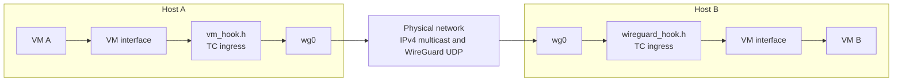
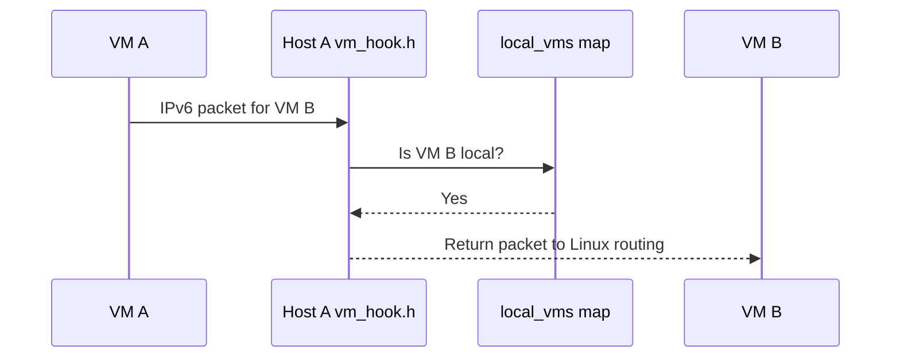
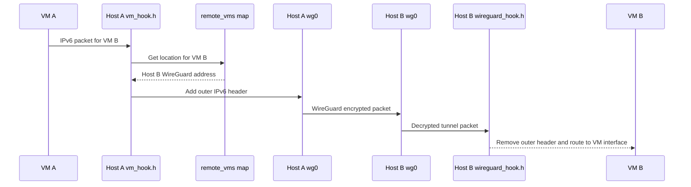
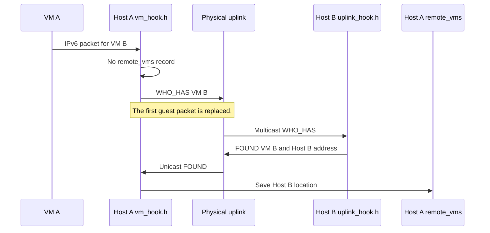
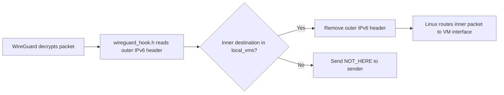
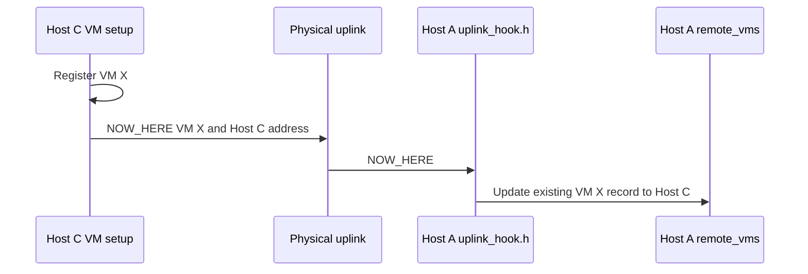
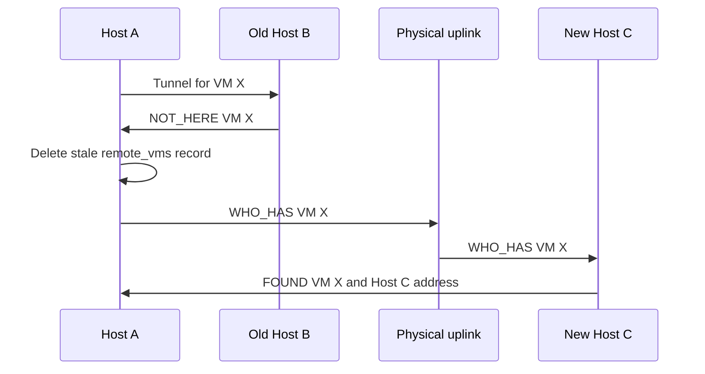
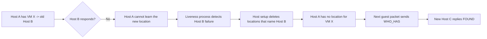

# Atlas WG Mesh design

This document explains packet paths, BPF state, and recovery behavior. Read the [operations guide](operations.md) for setup.

## Contents

- [Atlas WG Mesh design](#atlas-wg-mesh-design)
  - [Contents](#contents)
  - [Addressing and state](#addressing-and-state)
  - [Trust model](#trust-model)
  - [BPF interface](#bpf-interface)
  - [System view](#system-view)
  - [Scenario 1: local VM delivery](#scenario-1-local-vm-delivery)
  - [Scenario 2: known remote VM](#scenario-2-known-remote-vm)
  - [Scenario 3: first packet to a remote VM](#scenario-3-first-packet-to-a-remote-vm)
  - [Scenario 4: receive an Atlas WG Mesh tunnel](#scenario-4-receive-an-atlas-wg-mesh-tunnel)
  - [Scenario 5: planned VM move](#scenario-5-planned-vm-move)
  - [Scenario 6: missed move announcement](#scenario-6-missed-move-announcement)
  - [Scenario 7: old host failure](#scenario-7-old-host-failure)
  - [Scenario 8: falsely declared-dead host returns](#scenario-8-falsely-declared-dead-host-returns)
  - [Code map](#code-map)

## Addressing and state

Each host has a WireGuard address in `fdab::/16`. Each VM has an address in `fdaa::/16`.

```text
Bytes:  0  1 |  2  3 |  4  5  6  7 |  8  9 10 11 | 12 13 14 15
Field: fd aa | region |    tenant    |   reserved   |    VM ID
```

The data path uses the tenant field. Region and reserved fields are available to provisioning.

Atlas WG Mesh owns traffic between VM addresses. A source address must be registered on the ingress VM interface, and VMs cannot reach host WireGuard addresses in `fdab::/16`. Linux owns other host traffic. WireGuard encrypts host-to-host traffic. Atlas WG Mesh does not configure WireGuard, NAT, DNS, DHCP, or firewall rules.

## Trust model

VMs use `fdaa::/16`; host WireGuard addresses use `fdab::/16`. The VM hook drops traffic to `fdab::/16`, so VMs cannot reach the host subnet through Atlas WG Mesh.

Nonzero tenant IDs are isolated from each other. Tenant `0` can communicate with every tenant and must be assigned only to trusted platform services.

Discovery runs on a trusted multicast Layer-2 domain. `WHO_HAS`, `FOUND`, and `NOW_HERE` messages are not authenticated, so a host on that network can influence learned VM locations. WireGuard encrypts traffic only to configured peers.

Each VM defaults to 10 `WHO_HAS` messages per second with a burst of 50. This limits multicast floods from a VM; it does not authenticate discovery messages.

## BPF interface

| Hook | Program | Purpose |
| --- | --- | --- |
| VM interface | `handle_vm_packet` | Route local traffic, discover remote VMs, and add tunnel headers. |
| Physical uplink | `handle_uplink_packet` | Process discovery messages. |
| WireGuard interface | `handle_wireguard_packet` | Remove tunnel headers and send `NOT_HERE`. |

| Map | Purpose |
| --- | --- |
| `config` | Host configuration and discovery limits. |
| `local_vms`, `remote_vms` | Local ownership and learned remote locations. |
| `discovery_limits` | Per-VM discovery rate-limit state. |
| `debug_config`, `debug_stats`, `debug_events` | Optional debug state and events. |
| `build_hash` | Installed BPF object hash. |

## System view



The VM hook processes a packet from a VM interface. The WireGuard hook processes a packet after WireGuard decrypts it. The uplink hook processes Atlas WG Mesh discovery messages from the physical network.

## Scenario 1: local VM delivery

This path applies when both VMs are connected to the same host.



`vm_hook.h` returns `TC_ACT_OK`. Linux uses the host route for VM B and sends the packet to the destination interface. Atlas WG Mesh adds no tunnel header.

## Scenario 2: known remote VM

This path applies when `remote_vms` already has a location for the destination.



The outer IPv6 destination is the WireGuard address of Host B. The inner IPv6 packet stays unchanged.

## Scenario 3: first packet to a remote VM

This path applies when the host has no location for the destination VM.



The next packet from VM A uses Scenario 2. TCP normally sends the first packet again after the discovery exchange. The per-VM rate limit drops excess discovery packets.

## Scenario 4: receive an Atlas WG Mesh tunnel

This path applies after a remote host sends an Atlas WG Mesh IPv6-in-IPv6 tunnel.



The destination host never forwards an Atlas WG Mesh tunnel to another host. It either delivers the inner packet locally or sends `NOT_HERE`.

## Scenario 5: planned VM move

Use this path for a stopped VM. Register the VM on the new host before you start the guest.



`NOW_HERE` updates an existing record only. A host that never contacted VM X does not add VM X to its cache.

## Scenario 6: missed move announcement

This path applies when all `NOW_HERE` messages are lost but the old host still runs.



Host A starts discovery when it receives `NOT_HERE`. It does not wait for the guest to send another packet. The tunnel packet sent to Host B is still lost.

## Scenario 7: old host failure

This path applies when the old host is down and the move announcement did not reach every host.



Atlas WG Mesh has no timer for remote locations. A liveness process must delete locations that name a host after it leaves the deployment. If the host later returns, use Scenario 8 before allowing it to rejoin.

## Scenario 8: falsely declared-dead host returns

This path applies when liveness declares Host B dead during a partition, but Host B was still running when VM X moved to Host C. Host B retains VM X in `local_vms`.

```mermaid
sequenceDiagram
    participant A as Host A
    participant B as Returned Host B
    participant C as Current Host C
    participant R as Controller

    A->>B: WHO_HAS VM X
    B->>A: FOUND VM X, Host B
    A->>B: Tunnel for VM X
    B->>B: local_vms says VM X is local
    Note over B: Delivers the tunnel; does not send NOT_HERE
    R->>B: vm list --json
    R->>B: vm remove stale VM X
    A->>C: Next WHO_HAS / FOUND path reaches Host C
```

The stale owner suppresses the `NOT_HERE` repair path, so recovery is not automatic. On reconnect, the controller must compare `vm list --json` with current desired state and remove every stale ownership entry before the host resumes normal service. Do not replay a stale local manifest at boot.

## Code map

| File | Main responsibility |
| --- | --- |
| `bpf/bpf.c` | Build one BPF object from all source fragments. |
| `bpf/vm_hook.h` | Process packets from VM interfaces. |
| `bpf/uplink_hook.h` | Process `WHO_HAS`, `FOUND`, and `NOW_HERE` messages. |
| `bpf/wireguard_hook.h` | Process Atlas WG Mesh tunnels and `NOT_HERE` messages. |
| `bpf/control.h` | Build discovery and recovery packets. |
| `bpf/state.h` | Define host and VM BPF state. |
| `bpf/discovery_limit.h` | Define per-VM discovery rate limiting. |
| `bpf/debug.h` | Define debug maps and event helpers. |
| `bpf/protocol.h` | Define on-wire protocol values and structures. |
| `bpf/address.h` | Define VM address helpers. |
| `bpf/packet.h` | Define packet checksum and length helpers. |
